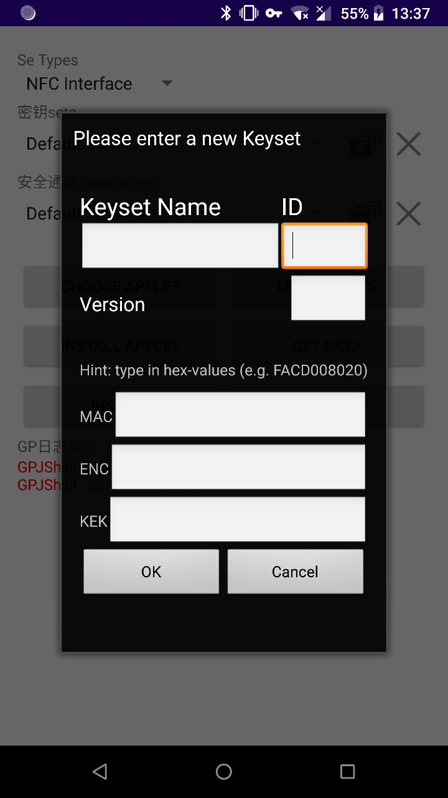

======================================
Picc多应用管理服务（GP模式个人化）
======================================

.. toctree::
   :maxdepth: 1
   
   ../CLperso/GP
   
	
进入SmartGP模块，拍卡，工具识别为NFC模式

	
1. Initialization

.. Note :: Before you can start with managing applets, you may have to scan the contactless smartcard with your Android device and select "NFC Interface" from the list of available readers. After you selected the reader, it is necessary to enter the correct keyset for your smartcard. (NOTE: GPDroid-NFC currently only supports access to the ISD on most smartcards and does not support management of supplementary security domains.) Furthermore, the parameters for the secure channel have to be set in a similar way. Default parameters are preinstalled, which may not necessarily fit for your smartcard.
	
2. 1 设置keysets和channel Parameters

.. Tip :: For the secure channel, you have to set 3 parameters. First, you may freely choose a name for the channel. The first parameter is the SCP version. The second parameter is the security level of the secure channel. Please note, that this may only be a value between 0 and 255. As a last parameter tick the checkbox if your card is a Gemalto smartcard. To finish and complete the settings page, click OK. Note, that the version as well as the security level has to be set.

.. Tip :: For your custom keyset, you begin by selecting a name, which you want to see in the selection. You may freely choose this name to your needs. This keyset will be bound to the selected reader! The ID has to match the keyset ID on the smartcard. If you don’t know the ID, look into the documentation of the smartcard. You may find it there together with the appropriate keys. The ID value is between 0 and 255. Afterwards you have to select a version number for the keyset and you have to set the 3 keys (in hexadecimal representation) for your smartcard. If you don’t know them, it is strongly recommended to stop using the application. You may brick your smartcard by authenticating with wrong keys, keyset version or keyset ID. After setting all parameters, click OK and the data will be saved to your local storage and will be available in the spinner. Note that you have to set the ID as well as the version before you can continue.

.. Tip :: give the gpshell as an example, you should open a secure channel as follows: open_sc -keyver 20 -kek_key 404142434445464748494A4B4C4D4E4C -mac_key 404142434445464748494A4B4C4D4E4B -enc_key 404142434445464748494A4B4C4D4E4A -scp 2 -scpimpl 85 -security 3

	

.. Note :: 默认channel Parameters为：SCP-Version = 02、Security Level = 00

.. Note :: 默认Keyset MAC为0x40 0x41 0x42 0x43 0x44 0x45 0x46 0x47 0x48 0x49 0x4A 0x4B 0x4C 0x4D 0x4E 0x4F

.. Note :: 默认Keyset ENC为0x40 0x41 0x42 0x43 0x44 0x45 0x46 0x47 0x48 0x49 0x4A 0x4B 0x4C 0x4D 0x4E 0x4F

.. Note :: 默认Keyset KEK为0x40 0x41 0x42 0x43 0x44 0x45 0x46 0x47 0x48 0x49 0x4A 0x4B 0x4C 0x4D 0x4E 0x4F

.. Note :: 默认Keyset Version为20

2. 2 Get ISD Data

.. Tip :: Clicking “Get ISD Data” will show you another screen, where you can enter the two parameters P1 and P2 to issue a GET DATA APDU command. The response will be shown in the log area as a string of hexadecimal digits.

2. 3 List Applets

.. Tip :: Clicking the "List Applets" button will give you a list of installed load files(application packages) and security domains on the card.

3. Managing Applets

.. Tip :: Pressing the "Choose Applet" button will prompt you with a selector for a file-manager. If you have not yet installed any file-manager, please check Google's Play Store (or your preferred application store) to get one. In the file manager, select the applet that you want to install on the card. The selected applet will be shown in the text box above the buttons.

	
.. Tip :: Before you install the applet, please check your previously by Pressing the 【set安装参数】button for correctness!

.. Tip :: After clicking the "Install Applet" button, you will be prompted with a screen asking you for further install parameters. If no parameters are necessary, please enter nothing or 0. Only if you are sure of the appropriate parameters, please type them into the editing fields. As soon as you click "Set", the install process will be started. If an error occurs, it will be shown in the log area. If some sort of crypto error or exception occurs, your keys or parameters may be wrong and you should double-check them!

.. warning :: Continuing with wrong keys may permanently brick your smartcard!

