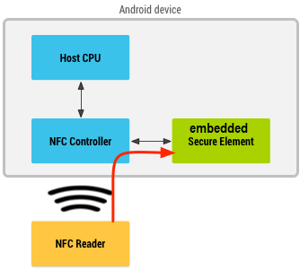
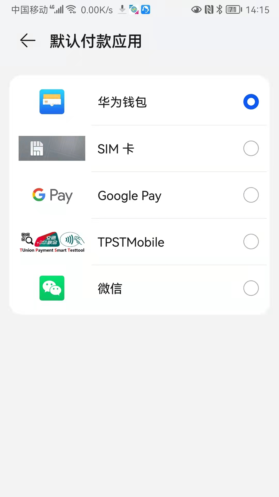
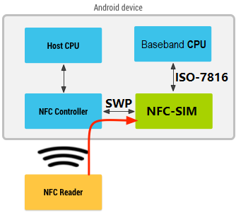
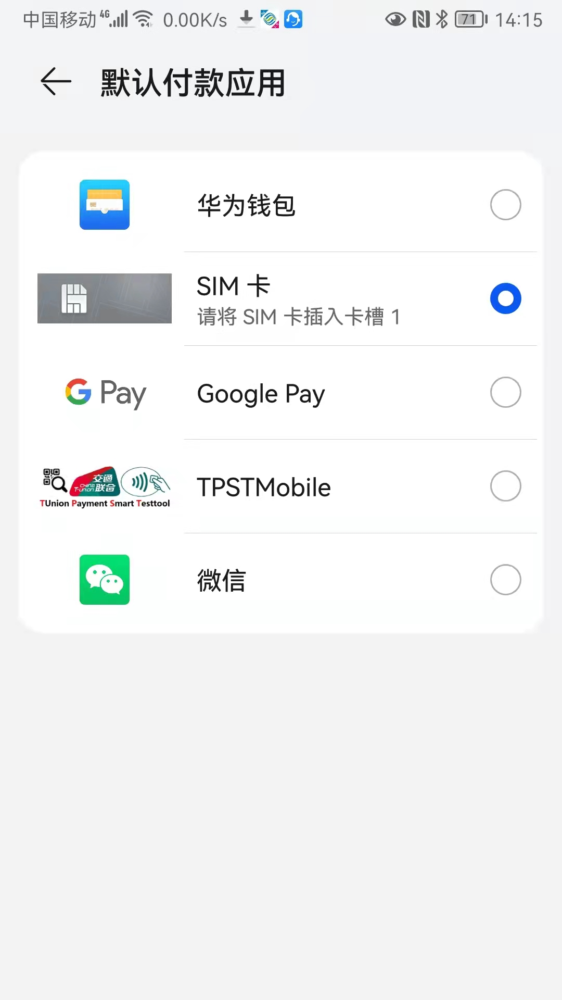
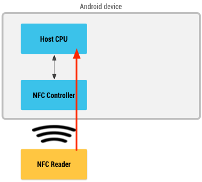
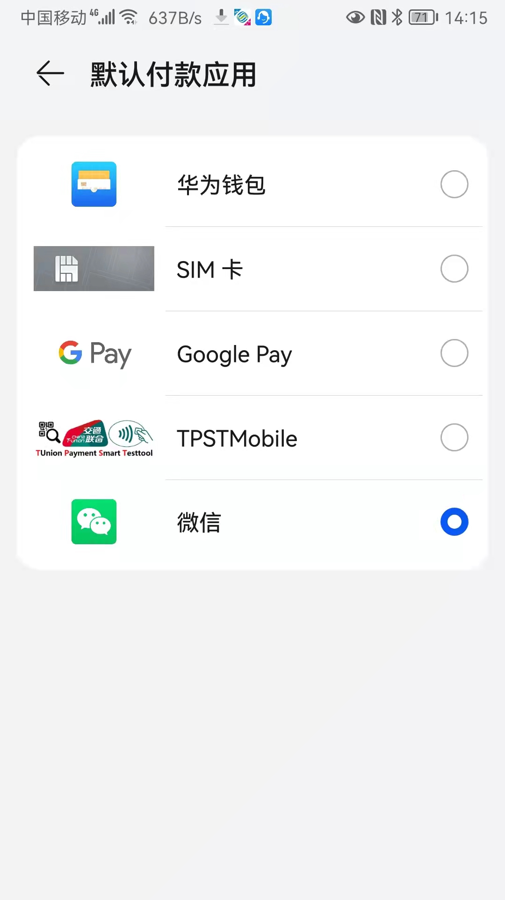
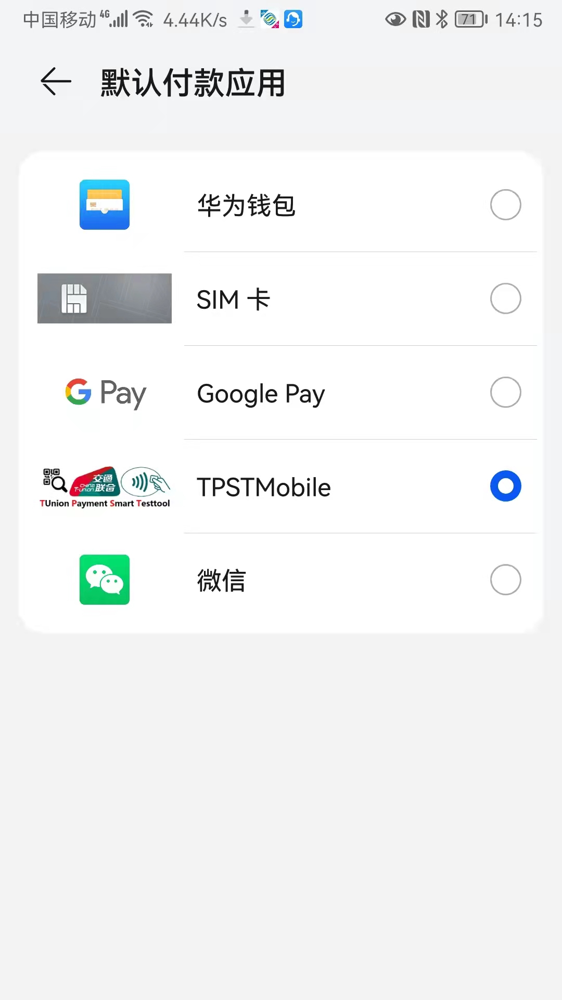

=================================
关于安卓NFC手机HCE设置的说明
=================================

文档编号：ZJJK-3000-？？

全终端模式（Embedded Security Engine）
--------------------------------------------------

.. Note :: 全终端模式

.. Note :: 以国产Honor手机设置为例

	
	

NFC-SIM模式
--------------------------------------------------

.. Note :: NFC-SIM

.. Note :: 以国产Honor手机设置为例，NFC-SIM需放置手机的SIM1卡槽

HCE模式
--------------------------------------------------

.. Note :: NFC-SIM

.. Note :: 以国产Honor手机设置为例，使用TPSTMobile微信小程序

	
.. Note :: 以国产Honor手机设置为例，使用TPSTMobile app程序

