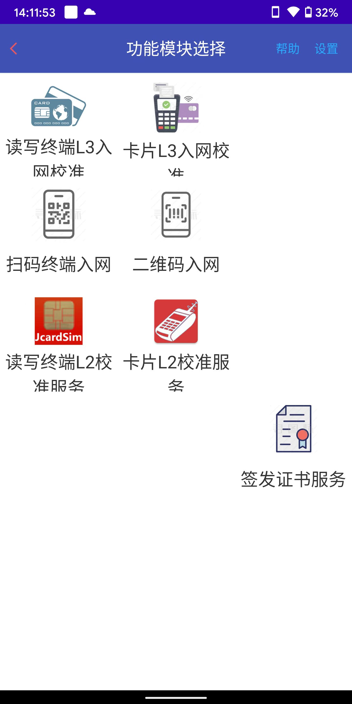
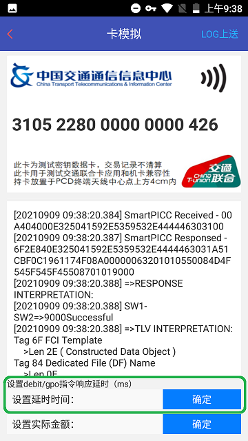

==========================
JT/T 1356.2-2020 校准服务
==========================

文档编号：ZJJK-3000-22-2022
	
	
.. Note :: 在专用手持设备上安装运行TPSTMobile app.实验室测试人员,需选择实验室【测试服务】;TPSTMobile付费用户,需选择实验室【调试服务】.

	

.. image:: ../_images/select_service.jpg
    :width: 300px
    :height: 533px
	
.. Note :: 开通指纹登录的用户,直接验证指纹登录.未开通指纹登录用户,输入账号密码登录.

.. image:: ../_images/login_by_fingerprint.png
    :width: 300px
    :height: 533px
	
	

.. image:: ../_images/gpatmobile_login.png 
    :width: 300px
    :height: 533px

	
	
.. Note :: 选择设置menu.在设置menu,需开启log显示和Le判别功能.

	
	

.. Note :: 选择【读写终端L2校准服务/JcardSIM】功能.

在菜单中选择要测试的kernel，工具进入案例选择界面

K1:交通部标准脱机（EP-CAPP）钱包（AID=A0 00 00 06 32 01 01 05仅国际or双算法）

K2:交通部标准脱机（EP-CAPP）钱包（AID=A0 00 00 06 32 01 01 07仅国密算法）

K3:交通部标准脱机（qMOT-EXT）现金（AID=A0 00 00 06 32 01 01 06仅国际or双算法）

K4:交通部标准脱机（qMOT-EXT）现金（AID=A0 00 00 06 32 01 01 08仅国密算法）

K5:交通部新标准工程验证现金应用（AID=A0 00 00 06 32 10 10 02仅国密算法）

K6:交通部新标准工程验证钱包应用（AID=A0 00 00 06 32 10 10 04仅国密算法）

.. Note :: 在钱包应用案例选择界面中选择【交易测试】，手工输入案例编号，工具采用HCE方式模拟相应的卡片特征值，被测终端与SmartPICC进行通信，被测终端识别SmartPICC模拟的卡片应用进行交易，允许交易的案例终端应交易成功（语音:刷卡成功;LED:绿色）并生成报文上传至【测试平台】;拒绝交易的案例终端应交易失败（语音:请投币;LED:红色;LCD屏显示要求的出错码）;

	
.. Note :: 在现金应用案例选择界面中选择【交易测试】，手工输入案例编号，工具采用HCE方式模拟相应的卡片特征值，被测终端与SmartPICC进行通信，被测终端识别SmartPICC模拟的卡片应用进行交易，允许交易的案例终端应交易成功（语音:刷卡成功;LED:绿色）并生成报文上传至【测试平台】;拒绝交易的案例终端应交易失败（语音:请投币;LED:红色;LCD屏显示要求的出错码）;

	
.. Note :: 在UI中延时时间为PCD发送debit指令后，HCE模拟PICC返回mac2+tac的时间，用于交易流程的部分案例专用，不设置为默认实时返回，在UI中实际金额设置，为PCD发送get balance指令后，HCE模拟PICC返回的余额，用于交易流程的部分案例专用，不设置为案例配置值

	

	
.. Note :: 完成【交易测试】后，再完成【白名单】测试，白名单内的测试案例，终端应交易成功（0余额的卡片应提示0余额或报出错码2731）;白名单内（机构代码和卡IIN不一致的测试案例）终端应拒绝交易报出错码5469;白名单外的案例终端应拒绝交易报出错码2449;每个测试案例完成交易测试后，选择界面右上角的【LOG上送】进入上送参数设置界面;

	

.. image:: ../_images/spysetting1.png 
    :width: 300px
    :height: 533px

	
.. Note :: 被测终端应用软件提示交易成功，选【被测终端(TPUT)刷卡成功log上送】，上送测试数据至实验室服务器;被测终端应用软件提示交易失败，选【被测终端(TPUT)刷卡失败log上送】，上送测试数据至实验室服务器;

	
	

.. Note :: 在上送参数设置界面，必需输入被测终端实验室样品编号，调试服务选择TPUT12345678;在上送参数设置界面，可选输入其他上送参数，例如:所在城市、交通方式、线路、设备版本、备注等信息，选【提交】;

	
	

	
.. Note :: 在上送参数设置完成后，选择提交，提示上送成功;

	

	

