==========================
JT/T 1356.1-2020 校准服务
==========================

文档编号：ZJJK-3000-21-2022

	
.. Note :: 在专用手持设备上安装运行TPSTMobile app.实验室测试人员,需选择实验室【测试服务】;TPSTMobile付费用户,需选择实验室【调试服务】.

	

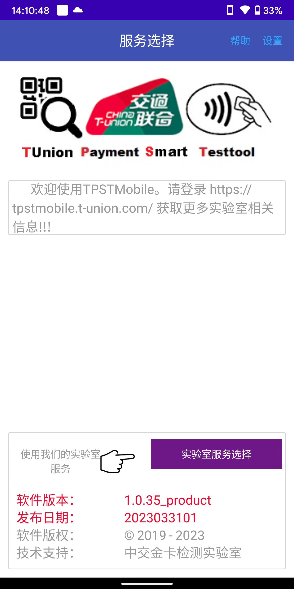
	
.. Note :: 开通指纹登录的用户,直接验证指纹登录.未开通指纹登录用户,输入账号密码登录.

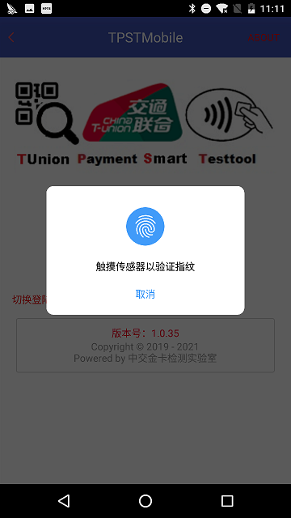
	
	

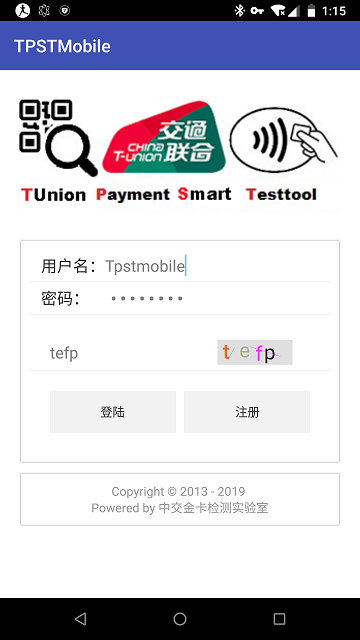
		
	
.. Note :: 选择【卡片L2校准服务/Smart PCD1】.再选择要校准的Kernel.

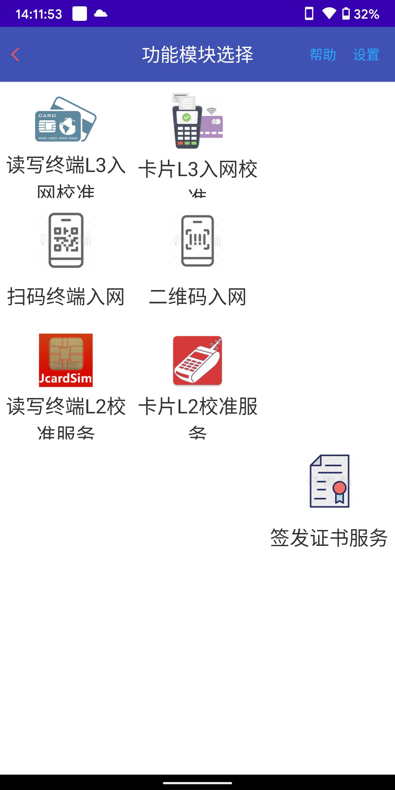
	

.. image:: ../_images/Smartpcd1_select_kernel.png
    :width: 300px
    :height: 533px
	
.. Note :: 以下为smartpcd1 钱包应用L2校准服务功能模块，选择Kernel编号
	
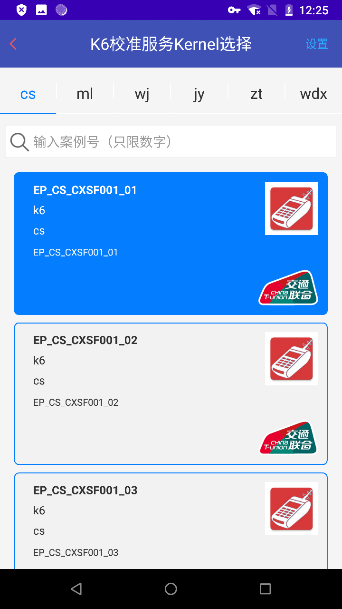
	
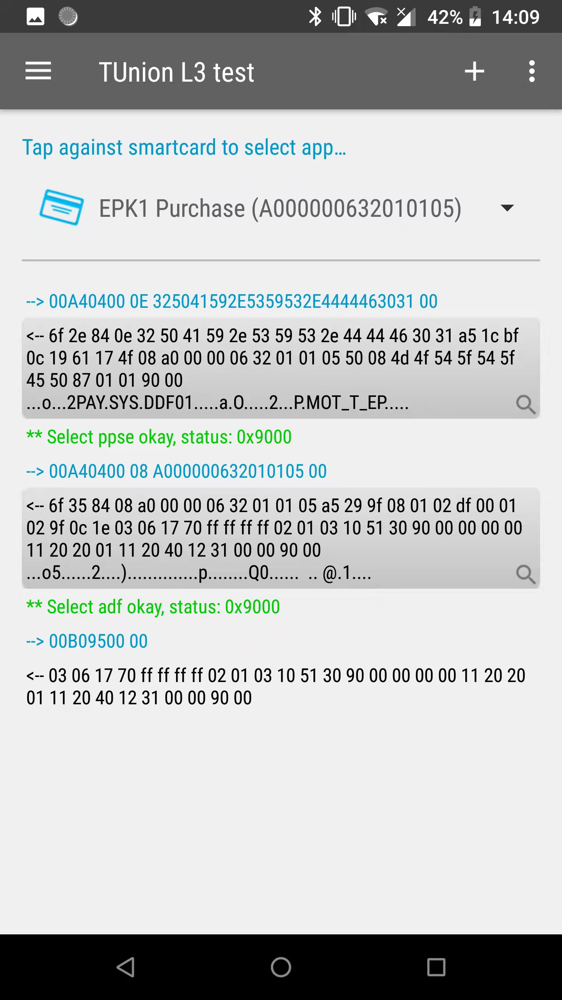
	
.. Note :: 以下为smartpcd1 现金应用L2校准服务功能模块，选择Kernel编号
	

	

	
.. Note :: 点选右上角menus，选择保存log方式
	
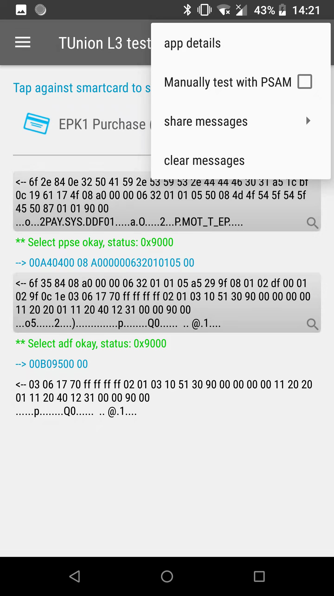
	
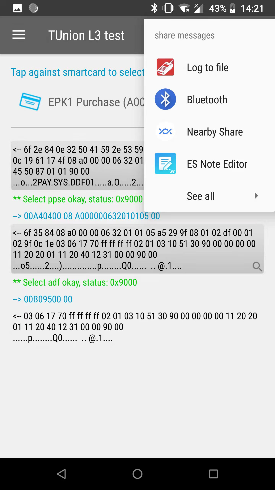
	
.. Note :: 保存为html格式log数据

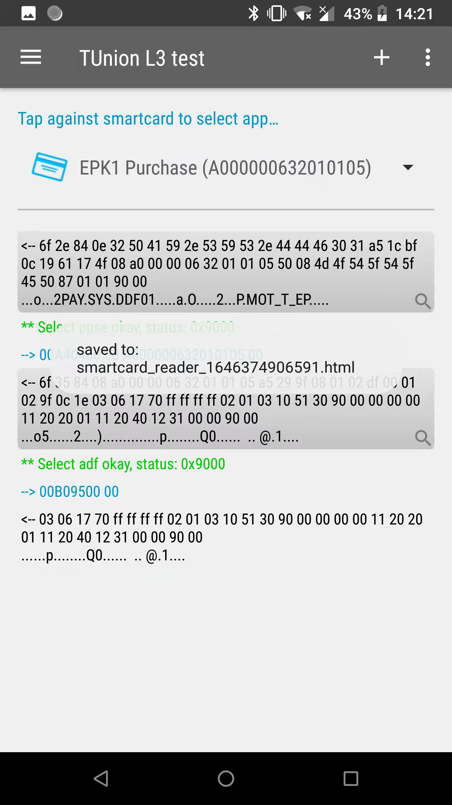
	
	
.. Note :: 点选卡片返回log部分，进入数据解析界面
	

	
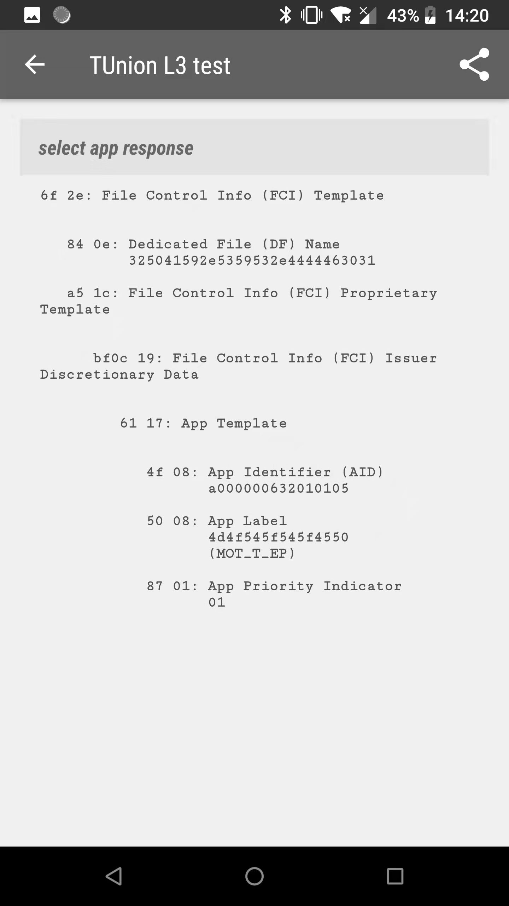
	
.. Note :: 点选右上角menus，选择保存为html格式log数据
	
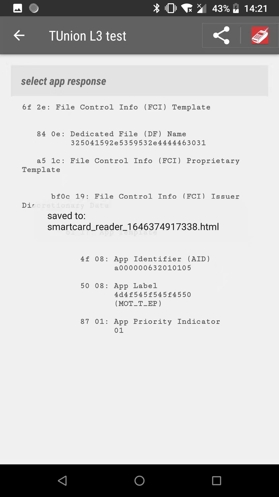
	
