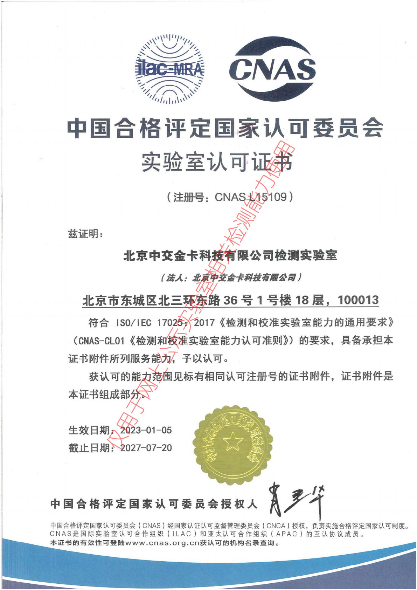

.. niftools_sphinx_theme documentation master file, created by
   sphinx-quickstart on Tue Sep 12 07:25:47 2017.
   You can adapt this file completely to your liking, but it should at least
   contain the root `toctree` directive.

实验室CNAS资质
============================================

.. Note :: CNAS资质

	
	

	
	

请访问 CNAS官方网站__  查询我们的CNAS资质	
	
.. __: https://las.cnas.org.cn/LAS_FQ/publish/orgBaseInfoScopePart.jsp?id=91147993796d42ea99b790ad0ea820ef&baseInfoId=9efec09da568490a883465a6394fbf80&labType=L&scopeStr=abilityL1_signPerson_keyBranch_&orgEnOrCh=Ch&licNo=L15109&certUpdateTs=2021-07-21&validate=2027-07-20

	
	
质量手册
--------------------

.. Note :: 质量手册

.. toctree::
   :maxdepth: 1
   
   ../cnas/ZJJK1000
   
程序文件和记录文件
----------------------------

.. Note :: 程序文件和记录文件（链接至gitlab wiki）

.. toctree::
   :maxdepth: 1
   
   ../cnas/ZJJK2000XX
   ../cnas/ZJJK2000 
   

   
作业指导
--------------------

.. Note :: 作业指导

.. toctree::
   :maxdepth: 1
   
   ../cnas/ZJJK3000

   
软著
------------------------------------------------------------

.. Note :: 软著

	

	

	
专利
------------------------------------------------------------

.. Note :: 专利

.. toctree::
   :maxdepth: 1
   
   ../patents