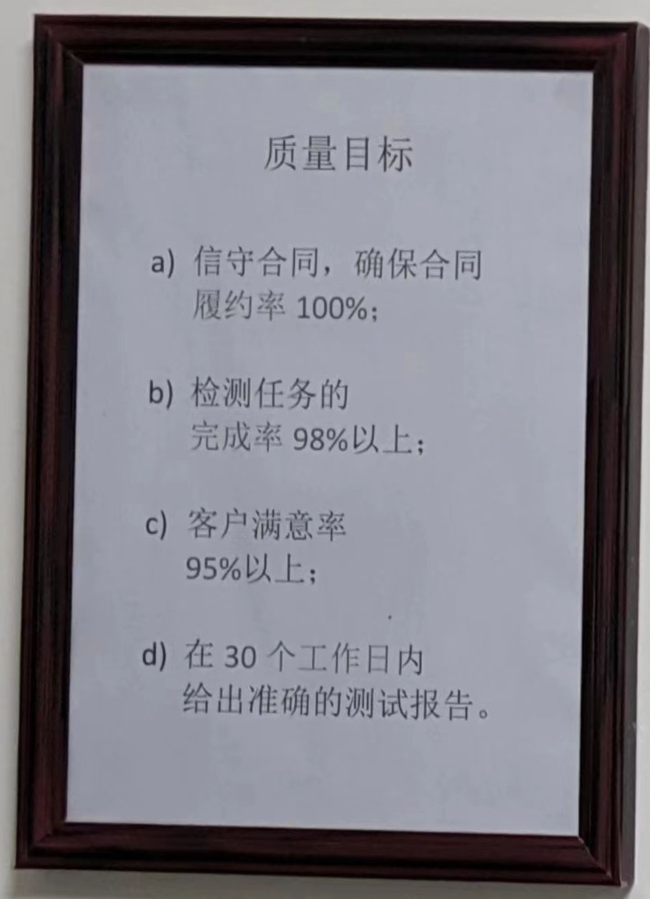
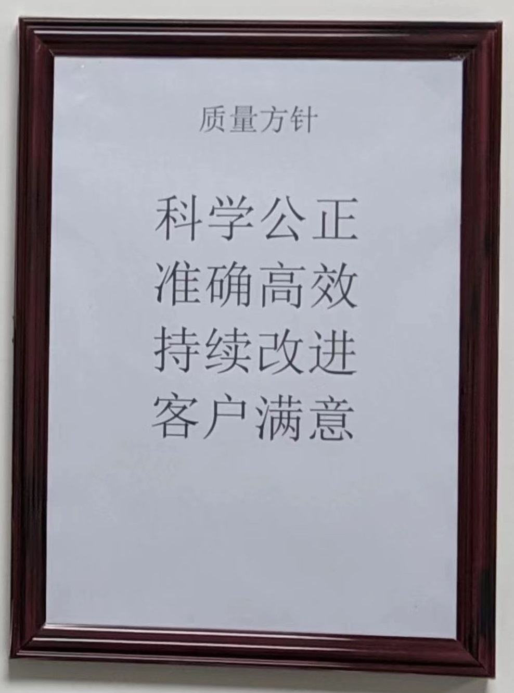

.. niftools_sphinx_theme documentation master file, created by
   sphinx-quickstart on Tue Sep 12 07:25:47 2017.
   You can adapt this file completely to your liking, but it should at least
   contain the root `toctree` directive.
   
质量目标
--------------------

	
	

	
质量方针
--------------------

	

质量手册
--------------------

.. cssclass:: table-bordered

+-----------------------+---------------------+-------------------------------------------+
| 文档编号（含版本信息）|更新日期             | 变更说明                                  |
+=======================+=====================+===========================================+
| ZJJK-1000-01-2023     |2019年7月1日         |初始版本                                   |
+-----------------------+---------------------+-------------------------------------------+

ZJJK-1000-01-北京中交金卡科技有限公司实验室质量手册-V3.0-2023__

.. __: https://kdocs.cn/l/cvNydOtE7LQN

