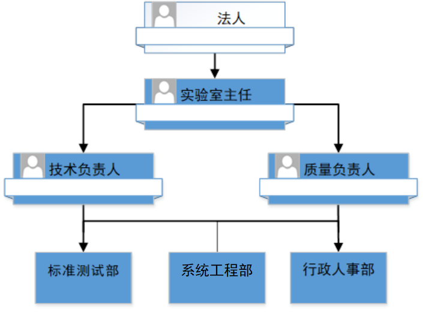

实验室历史沿革
================

    北京中交金卡科技有限公司检测实验室依托金卡公司下属标准测试部和系统工程部，正式成立于2019年7月1日,实验室现有人员11人。

2023年
-------------------

2023年1月5日，实验室通过2022年度CNAS监督和扩项评审;

2023年2月27日，实验室云测试小程序注册上线;

2023年4月14日，完成2022年度管理评审

2022年
-------------------

2022年1月，为八達通提供入网测试服务;

2022年2月，tpstmobile云平台系列软件获得国家版权局颁发的软件著作权;

2022年4月，实验室启动报文入网测试CNAS扩项工作;

2022年9月9日，实验室搬迁至新办公地点;

2022年9月17~18日，实验室在新办公地点接受CNAS监督和扩项评审;

2022年11月2日，实验室提供L2校准服务模块给客户评估使用;

2022年11月16日，按照CNAS评审要求完成整改,提交整改材料;

2022年12月，实验室完成2022年度内审;

2021年
-------------------

2021年1月22日，发送TPSTMobile测试设备给第一个付费客户;

2021年4月1日,变更实验室主任,质量负责人,授权签字人,检测技术员;

2021年4月19日,获取现场审核时间为2021年5月15日-16日:http://192.168.107.71:7816/CNAS/doc2pdf/CNASPD1409D0.pdf;

2021年5月16日,完成初次现场审核,获得的审核报告:http://192.168.107.71:7816/CNAS/doc2pdf/L26443-2020-01-report.pdf和6个不符合项:http://192.168.107.71:7816/CNAS/doc2pdf/L26443-2020-01-buglist.pdf;

2021年5月28日，实验室获得第一个付费委托测试客户(广东德生);

2021年6月16日，实验室完成提交整改报告;

2021年7月21日，实验室通过初次现场审核,获得证书编号：CNASL15109,进入CNAS预公布库;

2021年7月26日，实验室收到正式获批证书编号：CNASL15109;

2021年8月，实验室启用获批证书编号：CNASL15109为委托客户出具卡片业务入网测试报告;

2021年11月，实验室完成互联互通交易流程K5，K6设计并启动终端验证工作;

2021年12月，实验室完成2021年度内审和管理评审;

2020年
-------------------

2020年5月14日，正式向中国合格评定国家认可委员会秘书处提交申请材料:http://192.168.107.71:7816/webdoc1/README.html

2020年9月04日，获取认可受理通知书:http://192.168.107.71:7816/CNAS/doc2pdf/CNASL26443202001.pdf

2020年10月08日，收到第一次审查意见:http://192.168.107.71:7816/CNAS/doc2pdf/CNASL26443202001Z.pdf

2020年12月08日，收到第二次审查意见;

2019年
-------------------

2019年3月，立项开发TPSTMobile微信小程序，支撑全国交通一卡通互联互通入网白名单测试工作；

2019年4月，实验室平台建设方案和CNAS申请方案获批;

2019年5月，立项开发TPSTPC版支持国产商用密码技术的卡片L2测试案例;

2019年6月30日，金卡公司批复以金卡公司标准测试部、系统工程部、行政人事部团队为基础,成立北京中交金卡科技有限公司检测实验室:http://192.168.107.71:7816/CNAS/doc2pdf/CNASL26443-1-2.pdf

2019年7月01日，实验室获得金卡公司法人授权书,采用CNAS质量体系初始运营:http://192.168.107.71:7816/CNAS/doc2pdf/CNASL26443-1-3.pdf；

2018年
-------------------

2018年4月，立项开发TPSTMobile云平台服务和android应用程序，支撑金卡检测实验室入网测试工作；

2018年9月，发布第一个版本 TPSTMobile_V1.0.0_20180904 给成员机构试用；

2017年
-------------------

2016年
-------------------

2016年3月，立项开发TPST PC版云平台测试工具，支撑全国交通一卡通互联互通入网测试工作；

2015年
-------------------

2015年4月，开发基于snooper工具的测试脚本，协助长春轨道、江苏省一卡通公司,吉林通等成员机构开展互联互通入网测试工作；

	
