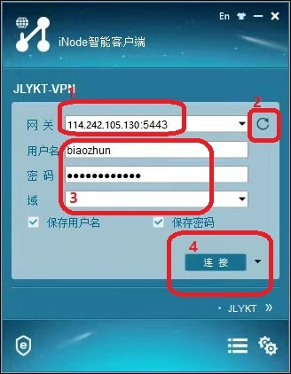
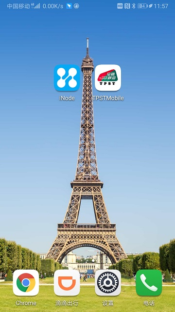
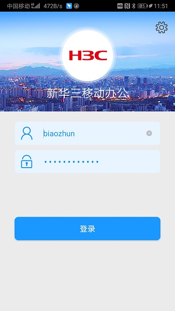
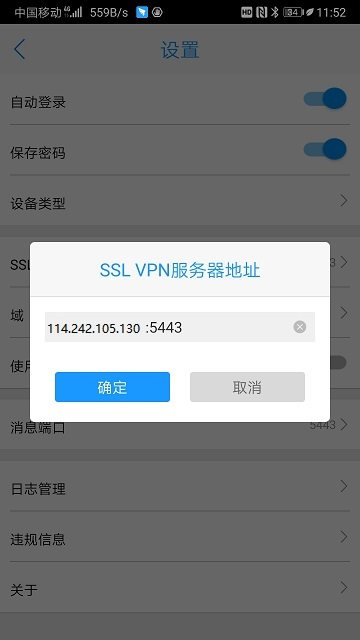
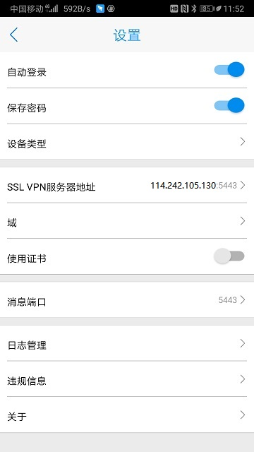
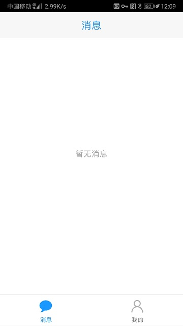

=================
实验室VPN使用说明
=================

.. cssclass:: table-bordered

+-----------------------+---------------------+-------------------------------------------+
| 文档编号（含版本信息）|更新日期             | 变更说明                                  |
+=======================+=====================+===========================================+
| ZJJK-3000-xx-2021     |2019年7月1日         |初始版本                                   |
+-----------------------+---------------------+-------------------------------------------+

实验室inode使用说明(PC vpn至实验室机房)
-------------------------------------------------

.. Note :: 在设备桌面上找到inode图标并双击运行

第一步：1填入IP和端口，2刷新

第二步：3填入帐号和密码

第三步：4点击连接

	

实验室inode使用说明(移动设备 vpn至实验室机房)
-----------------------------------------------------

.. Note :: 在设备桌面上找到inode图标并双击运行

	
.. Note :: 在登录UI上面选择右上角设置图标

	
.. Note :: 在设置UI上面选择SSL VPN服务器地址和端口

	
.. Note :: 设置SSL VPN服务器地址和端口

	
.. Note :: 在登录UI上面输入vpn账号和密码

	
	
.. Note :: 在登录成功后UI如下

	