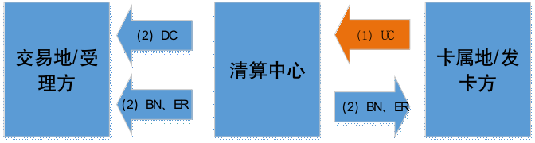

.. niftools_sphinx_theme documentation master file, created by
   sphinx-quickstart on Tue Sep 12 07:25:47 2017.
   You can adapt this file completely to your liking, but it should at least
   contain the root `toctree` directive.

互联互通报文测试作业指导
============================================

.. cssclass:: table-bordered

+-----------------------+---------------------+-------------------------------------------+
| 文档编号（含版本信息）|更新日期             | 变更说明                                  |
+=======================+=====================+===========================================+
| ZJJK-3000-18-2021     |2021年12月11日       |初始版本                                   |
+-----------------------+---------------------+-------------------------------------------+

参数交互类文件上传下载测试
------------------------------------------  
.. Note :: 所有交易记录将以“清算中心流水号”为唯一标识。涉及文件类型：UC黑名单类型文件、DC黑名单文件、BN白名单、ER错误代码文件。

.. cssclass:: table-bordered

+----+----------------------------+----------------------------+---------------------+---------------------------+
|标识|文件名称                    |传输方向                    |文件类别             |测试依据                   |
+====+============================+============================+=====================+===========================+
| UC |黑名单上传文件              |未使用                      |参数类               |JT/T978.4 6.A.B.C.D.E.F    | 
+----+----------------------------+----------------------------+---------------------+---------------------------+
| DC |黑名单下发文件              |未使用                      |参数类               |JT/T978.4 6.A.B.C.D.E.F    | 
+----+----------------------------+----------------------------+---------------------+---------------------------+
| BN |白名单下发文件              |UAT->收单(发卡)机构         |参数类               |JT/T978.4 6.A.B.C.D.E.F    | 
+----+----------------------------+----------------------------+---------------------+---------------------------+
| ER |错误代码下发文件            |UAT->收单(发卡)机构         |参数类               |JT/T978.4 6.A.B.C.D.E.F    | 
+----+----------------------------+----------------------------+---------------------+---------------------------+

.. Tip :: 测试流程如下

	
入网成员机构 (as Ticket Acquiring Service、交易地/受理方功能测试)
---------------------------------------------------------------------
.. Note :: 此模式下上送互联互通异地消费【代扣和圈存】数据

.. Note :: 先清后验业务模式不使用CQ、RP和FN文件

.. cssclass:: table-bordered

+----+----------------------------+----------------------------+---------------------+---------------------------+
|标识|文件名称                    |传输方向                    |文件类别             |测试依据                   |
+====+============================+============================+=====================+===========================+
| CQ |消费明细数据文件            |收单机构->UAT               |交易类(不使用)       |JT/T978.4 6.A.B.C.D.E.F    |
+----+----------------------------+----------------------------+---------------------+---------------------------+
| RP |消费明细验证反馈文件        |发卡机构->UAT               |交易类(不使用)       |JT/T978.4 6.A.B.C.D.E.F    |
+----+----------------------------+----------------------------+---------------------+---------------------------+
| FN |入账通知文件 	            |UAT->发卡机构               |清算类(不使用)       |JT/T978.4 6.A.B.C.D.E.F    | 
+----+----------------------------+----------------------------+---------------------+---------------------------+

.. Tip :: 先清算后验证类文件（5个：上传CD、下载FB、下载LD、下载CR、下载BP）

.. Tip:: 参数类文件（1个：下载IN）

.. cssclass:: table-bordered

+----+----------------------------+----------------------------+---------------------+---------------------------+
|标识|文件名称                    |传输方向                    |文件类别             |测试依据                   |
+====+============================+============================+=====================+===========================+
| CD |脱机消费明细文件            |收单机构->UAT               |交易类               |JT/T978.4 6.A.B.C.D.E.F    |
+----+----------------------------+----------------------------+---------------------+---------------------------+
| CL |脱机消费清算明细文件        |UAT->发卡机构               |清算类               |JT/T978.4 6.A.B.C.D.E.F    |
+----+----------------------------+----------------------------+---------------------+---------------------------+
| FB |消费清算反馈文件            |UAT->收单机构               |清算类               |JT/T978.4 6.A.B.C.D.E.F    |
+----+----------------------------+----------------------------+---------------------+---------------------------+
| LD |已处理文件清单文件          |UAT->收单(发卡)机构         |清算类               |JT/T978.4 6.A.B.C.D.E.F    |
+----+----------------------------+----------------------------+---------------------+---------------------------+
| CR |消费清算结果明细文件        |UAT->收单(发卡)机构         |清算类               |JT/T978.4 6.A.B.C.D.E.F    |
+----+----------------------------+----------------------------+---------------------+---------------------------+
| BP |收支文件                    |UAT->收单(发卡)机构         |清算类               |JT/T978.4 6.A.B.C.D.E.F    | 
+----+----------------------------+----------------------------+---------------------+---------------------------+
| IN |异地交易机构信息文件        |UAT->收单(发卡)机构         |参数类               |JT/T978.4 6.A.B.C.D.E.F    | 
+----+----------------------------+----------------------------+---------------------+---------------------------+

.. Tip :: 差错处理类文件（3个：上传ED、发卡机构回复CM、下载AD）

.. cssclass:: table-bordered

+----+----------------------------+----------------------------+---------------------+---------------------------+
|标识|文件名称                    |传输方向                    |文件类别             |测试依据                   |
+====+============================+============================+=====================+===========================+	
| ED |差错处理文件                |收单机构<->UAT<->发卡机构   |差错处理类           |JT/T978.4 6.A.B.C.D.E.F    |
+----+----------------------------+----------------------------+---------------------+---------------------------+
| CM |确认机构差错处理结果通知文件|收单机构->UAT<-发卡机构     |差错处理类           |JT/T978.4 6.A.B.C.D.E.F    |
+----+----------------------------+----------------------------+---------------------+---------------------------+	
| AD |争议交易调整明细文件        |UAT->收单(发卡)机构         |清算类               |JT/T978.4 6.A.B.C.D.E.F    |
+----+----------------------------+----------------------------+---------------------+---------------------------+

.. Tip :: 异常交易差错处理验证流程

.. mermaid::

  graph TD

    开始 --> 收单机构发起异常交易验证6001 --> 发卡机构回复异常交易验证回复码01 --> 结束
	
	收单机构发起异常交易验证6001 --> 发卡机构回复异常交易验证回复码02 --> 收单机构仅可发起例外协商原因码4005/4007
	
	收单机构仅可发起例外协商原因码4005/4007 --> 发卡机构回复例外协商处理回复码01 --> 发卡机构发起例外长款处理5005/5008 --> 结束
	
	收单机构仅可发起例外协商原因码4005/4007 --> 发卡机构回复例外协商处理回复码02 --> 结束

.. Tip :: 正常交易差错处理验证流程(收单机构有回复)

.. mermaid::

  graph TD
  
      开始 --> 发卡机构发起确认查询1001/1005 --> 收单机构回复确认查询回复码01/0 --> 发卡机构发起确认查询1002/1006
	  
	  发卡机构发起确认查询1002/1006 --> 收单机构回复确认查询回复码01 --> 发卡机构可发起例外协商处理4006/4007/1
	  
	  发卡机构可发起例外协商处理4006/4007/1 --> 收单机构回复例外协商处理回复码02/1 --> 结束

      发卡机构可发起例外协商处理4006/4007/1 --> 收单机构回复例外协商处理回复码01/1 --> 	收单机构发起例外长款5006/5007/1  --> 结束 
	  
	  发卡机构发起确认查询1002/1006 --> 收单机构回复确认查询回复码02 --> 收单机构发起贷记调整2001 --> 发卡机构可发起例外协商处理4006/4007/2

	  发卡机构发起确认查询1002/1006 --> 收单机构回复确认查询回复码03 --> 发卡机构发起退单
	  
      发卡机构可发起例外协商处理4006/4007/2 --> 收单机构回复例外协商处理回复码02/2 --> 结束

      发卡机构可发起例外协商处理4006/4007/2 --> 收单机构回复例外协商处理回复码01/2 --> 	收单机构发起例外长款5006/5007/2  --> 结束 
	  
	  发卡机构发起退单 --> 收单机构回复退单回复码01 --> 结束
	  
	  发卡机构发起退单 --> 收单机构回复退单回复码02 --> 发卡机构可发起例外协商处理4002/4005/4007
	  
	  发卡机构可发起例外协商处理4002/4005/4007  -->  收单机构回复例外协商回复码02 --> 结束
	  
	  发卡机构可发起例外协商处理4002/4005/4007  -->  收单机构回复例外协商回复码01 -->  收单机构需发起例外长款5002/5005/5007 --> 结束
	  
	  
.. Tip :: 正常交易差错处理验证流程(收单机构无回复)

.. mermaid::

  graph TD
  
      开始 --> 发卡机构发起确认查询1001/1005 --> 发卡机构发起确认查询1002/1006
	  
	  发卡机构发起确认查询1002/1006 --> 收单机构回复确认查询回复码01 --> 发卡机构可发起例外协商处理4006/4007/1
	  
	  发卡机构可发起例外协商处理4006/4007/1 --> 收单机构回复例外协商处理回复码02/1 --> 结束

      发卡机构可发起例外协商处理4006/4007/1 --> 收单机构回复例外协商处理回复码01/1 --> 	收单机构发起例外长款5006/5007/1  --> 结束 
	  
	  发卡机构发起确认查询1002/1006 --> 收单机构回复确认查询回复码02 --> 收单机构发起贷记调整2001 --> 发卡机构可发起例外协商处理4006/4007/2

	  发卡机构发起确认查询1002/1006 --> 收单机构回复确认查询回复码03 --> 发卡机构发起退单
	  
      发卡机构可发起例外协商处理4006/4007/2 --> 收单机构回复例外协商处理回复码02/2 --> 结束

      发卡机构可发起例外协商处理4006/4007/2 --> 收单机构回复例外协商处理回复码01/2 --> 	收单机构发起例外长款5006/5007/2  --> 结束 
	  
	  发卡机构发起退单 --> 收单机构回复退单回复码01 --> 结束
	  
	  发卡机构发起退单 --> 收单机构回复退单回复码02 --> 发卡机构可发起例外协商处理4002/4005/4007
	  
	  发卡机构可发起例外协商处理4002/4005/4007  -->  收单机构回复例外协商回复码02 --> 结束
	  
	  发卡机构可发起例外协商处理4002/4005/4007  -->  收单机构回复例外协商回复码01 -->  收单机构需发起例外长款5002/5005/5007 --> 结束

.. mermaid::

   sequenceDiagram
    participant 待测试的入网机构业务系统
    participant UAT
    participant TPSTMobile入网测试服务系统
	participant 不完整交易发生地成员机构
	
	待测试的入网机构业务系统->>UAT:通过smartpicc模拟收单机构代码组包上送（消费CD、代扣WT、圈存LQ）文件
	
	待测试的入网机构业务系统-->>UAT:采用自己的业务系统组包上送（消费CD、代扣WT、圈存LQ）文件
	
	loop UAT engine
        UAT-->>UAT:（消费CD、代扣WT、圈存LQ）文件包功能比对
    end
	
	loop UAT engine
        UAT-->>UAT:（消费CD、代扣WT、圈存LQ）文件包数据解析和数据交换处理
    end
	
	Note left of UAT: 采用先清算后验证流程
	

	
	loop UAT 消费engine
        UAT-->>UAT:下发给收单机构FB、下发给发卡机构CL
    end
	
	loop UAT 代扣engine
        UAT-->>UAT:下发给收单机构WB、下发给发卡机构WL
    end
	
	loop UAT 圈存engine
        UAT-->>UAT:下发给收单机构LB、下发给发卡机构LL
    end
	
	UAT->>TPSTMobile入网测试服务系统:清算明細（消费CL、代扣WL、圈存LL）文件
	
	UAT->>待测试的入网机构业务系统:清算反馈（消费FB、代扣WB、圈存LB）文件
	
	Note right of TPSTMobile入网测试服务系统: 对（消费CL、代扣WL、圈存LL）文件中的TAC或TC正常的数据处理
	
	Note right of TPSTMobile入网测试服务系统: 对（消费CL、代扣WL、圈存LL）文件中的TAC或TC异常的数据处理
	
	loop 机构差错处理engine
        待测试的入网机构业务系统-->>待测试的入网机构业务系统:发现差错记并生成差错处理文件ED
    end
	
	Note left of 待测试的入网机构业务系统: 对交易成功、失败的数据，都可以发起差错调整
	
	待测试的入网机构业务系统->>UAT:差錯處理文件ED
	
	Note left of UAT: 收单方差错发起
	
	loop UAT 差错处理engine
        UAT-->>UAT:差错申请处理并按照确认方分拆ED文件
    end
	
	UAT-->>TPSTMobile入网测试服务系统:差錯處理文件ED
	
	loop 机构差错处理engine
        TPSTMobile入网测试服务系统-->>TPSTMobile入网测试服务系统:进行差错确认并生成发卡方差错调整文件CM
    end
	
	Note right of TPSTMobile入网测试服务系统: 发卡机构需人工回复
	
	TPSTMobile入网测试服务系统-->>UAT:机构差错处理结果通知文件CM
	
	loop UAT 差错处理engine
        UAT-->>UAT:差错处理并生成交易调整清算明细文件AD
    end
	
	UAT->>待测试的入网机构业务系统:爭議交易調整明細（消費AD、代扣WD、圈存LD）文件
	
	UAT->>TPSTMobile入网测试服务系统:爭議交易調整明細（消費AD、代扣WD、圈存LD）文件
	
	Note right of TPSTMobile入网测试服务系统: 只能主动发起交易为成功的数据调整
	
	TPSTMobile入网测试服务系统->>UAT:差錯處理文件ED
	
	Note left of UAT: 发卡方差错发起
	
	UAT-->>待测试的入网机构业务系统:差錯處理文件ED
	
	Note left of 待测试的入网机构业务系统: 收单机构需人工回复
	
	待测试的入网机构业务系统-->>UAT:机构差错处理结果通知文件CM
	
	UAT->>待测试的入网机构业务系统:爭議交易調整明細（消費AD、代扣WD、圈存LD）文件
	
	UAT->>TPSTMobile入网测试服务系统:爭議交易調整明細（消費AD、代扣WD、圈存LD）文件
	
	Note left of UAT: 日终结算
	
	UAT->>待测试的入网机构业务系统:消費已處理文件清單文件LD
	
	UAT->>TPSTMobile入网测试服务系统:消費已處理文件清單文件LD
	
	UAT->>待测试的入网机构业务系统:清算結果明細（消費CR、代扣WC、圈存LC）文件
	
	UAT->>TPSTMobile入网测试服务系统:清算結果明細（消費CR、代扣WC、圈存LC）文件
	
	UAT->>待测试的入网机构业务系统:收支文件BP
	
	UAT->>TPSTMobile入网测试服务系统:收支文件BP
	
	UAT->>待测试的入网机构业务系统:机构信息文件IN
	
	UAT->>TPSTMobile入网测试服务系统:机构信息文件IN
	
	Note left of UAT: 采用先清算后验证流程完成数据交换
	
	UAT->>TPSTMobile入网测试服务系统:（圈存业务）人工或调用支付接口完成备付资金划拨
	
	UAT->>待测试的入网机构业务系统:（消费业务）人工或调用支付接口完成备付资金划拨
	
	UAT->>不完整交易发生地成员机构:（代扣业务）人工或调用支付接口完成备付资金划拨
	
	

	
报文测试使用的SmartPICC虚拟卡特征值
------------------------------------------
.. Note :: 入网机构测试【交易地/受理方】功能，推荐使用如下SmartPICC虚拟卡进行报文对接测试

.. Tip:: 交易成功后，入网机构采用自己的业务系统自行组包上送生成待测试的CD文件

.. Tip:: 交易成功后，入网测试云平台可以模拟入网机构生成待测试的CD文件，查看 https://tpstmobile.t-union.com/ZjjkManagerService/login

	
.. Note :: 选择如下L3校准服务中的钱包应用K1、K2、K6中白名单（报文）中的虚拟卡特征值

.. cssclass:: table-bordered

+-------------------+---------------------+---------------------+---------------------+----------------------------------------------+
| kernel            |白名单(报文)中特征值 | 收单机构参数        |报文算法             |说明                                          |
+===================+=====================+=====================+=====================+==============================================+
| K1大陆交易第1票种 |profile0000320       |15212482FFFFFFFF     |国际算法             |使用K1L3校准服务中和profile相同编号的用例     |
+-------------------+---------------------+---------------------+---------------------+----------------------------------------------+
| K1大陆交易第1票种 |profile0000320之外的 |19981001FFFFFFFF     |国际算法             |使用K1L3校准服务中和profile相同编号的用例     |
+-------------------+---------------------+---------------------+---------------------+----------------------------------------------+
| K2大陆交易第1票种 |profile0000320       |15212482FFFFFFFF     |国密算法             |使用K2L3校准服务中和profile相同编号的用例     |
+-------------------+---------------------+---------------------+---------------------+----------------------------------------------+
| K2大陆交易第1票种 |profile0000320之外的 |19981001FFFFFFFF     |国密算法             |使用K2L3校准服务中和profile相同编号的用例     |
+-------------------+---------------------+---------------------+---------------------+----------------------------------------------+
| K6大陆交易第1票种 |profile0000320       |15212482FFFFFFFF     |国密算法             |使用K6L3校准服务中和profile相同编号的用例     |
+-------------------+---------------------+---------------------+---------------------+----------------------------------------------+
| K6大陆交易第1票种 |profile0000320之外的 |19981001FFFFFFFF     |国密算法             |使用K6L3校准服务中和profile相同编号的用例     |
+-------------------+---------------------+---------------------+---------------------+----------------------------------------------+
| K6海外交易第1票种 |profile0005823       |10019101FFFFFFFF     |国密算法             |使用K6L3校准服务中和profile相同编号的用例     |
+-------------------+---------------------+---------------------+---------------------+----------------------------------------------+
| K6海外交易第2票种 |profile0005259       |10019101FFFFFFFF     |国密算法             |使用K6L3校准服务中和profile相同编号的用例     |
+-------------------+---------------------+---------------------+---------------------+----------------------------------------------+
| K6海外交易第2票种 |profile0006237       |19981001FFFFFFFF     |国密算法             |使用K6L3校准服务中和profile相同编号的用例     |
+-------------------+---------------------+---------------------+---------------------+----------------------------------------------+

.. Note :: 选择如下L3校准服务中的现金应用K3、K4、K5和KQ中白名单（报文）中的虚拟卡特征值

.. cssclass:: table-bordered

+-------------------+---------------------+---------------------+---------------------+----------------------------------------------+
| kernel            |虚拟卡特征值         | 收单机构参数        |报文算法             |说明                                          |
+===================+=====================+=====================+=====================+==============================================+
| K3大陆交易第1票种 |profile0000320       |15212482FFFFFFFF     |国际算法             |使用K3L3校准服务中和profile相同编号的用例     |
+-------------------+---------------------+---------------------+---------------------+----------------------------------------------+
| K3大陆交易第1票种 |profile0000320之外的 |19981001FFFFFFFF     |国际算法             |使用K3L3校准服务中和profile相同编号的用例     |
+-------------------+---------------------+---------------------+---------------------+----------------------------------------------+
| K4大陆交易第1票种 |profile0000320       |15212482FFFFFFFF     |国密算法             |使用K4L3校准服务中和profile相同编号的用例     |
+-------------------+---------------------+---------------------+---------------------+----------------------------------------------+
| K4大陆交易第1票种 |profile0000320之外的 |19981001FFFFFFFF     |国密算法             |使用K4L3校准服务中和profile相同编号的用例     |
+-------------------+---------------------+---------------------+---------------------+----------------------------------------------+
| K5大陆交易第1票种 |profile0000320       |15212482FFFFFFFF     |国密算法             |使用K5L3校准服务中和profile相同编号的用例     |
+-------------------+---------------------+---------------------+---------------------+----------------------------------------------+
| K5大陆交易第1票种 |profile0000320之外的 |19981001FFFFFFFF     |国密算法             |使用K5L3校准服务中和profile相同编号的用例     |
+-------------------+---------------------+---------------------+---------------------+----------------------------------------------+
| K5海外交易第1票种 |profile0005823       |10019101FFFFFFFF     |国密算法             |使用K5L3校准服务中和profile相同编号的用例     |
+-------------------+---------------------+---------------------+---------------------+----------------------------------------------+
| K5海外交易第2票种 |profile0005259       |10019101FFFFFFFF     |国密算法             |使用K5L3校准服务中和profile相同编号的用例     |
+-------------------+---------------------+---------------------+---------------------+----------------------------------------------+
| K5海外交易第2票种 |profile0006237       |19981001FFFFFFFF     |国密算法             |使用K5L3校准服务中和profile相同编号的用例     |
+-------------------+---------------------+---------------------+---------------------+----------------------------------------------+
| KQ大陆交易第1票种 |profile0006169       |15212482FFFFFFFF     |国密算法             |使用K5L3校准服务中和profile相同编号的用例     |
+-------------------+---------------------+---------------------+---------------------+----------------------------------------------+
| KQ大陆交易第1票种 |profile0000320之外的 |19981001FFFFFFFF     |国密算法             |使用K5L3校准服务中和profile相同编号的用例     |
+-------------------+---------------------+---------------------+---------------------+----------------------------------------------+
| KQ海外交易第1票种 |profile0008772       |10019101FFFFFFFF     |国密算法             |使用K5L3校准服务中和profile相同编号的用例     |
+-------------------+---------------------+---------------------+---------------------+----------------------------------------------+
| KQ海外交易第2票种 |profile0008771       |10019101FFFFFFFF     |国密算法             |使用K5L3校准服务中和profile相同编号的用例     |
+-------------------+---------------------+---------------------+---------------------+----------------------------------------------+
| KQ海外交易第2票种 |profile5006237       |19981001FFFFFFFF     |国密算法             |使用K5L3校准服务中和profile相同编号的用例     |
+-------------------+---------------------+---------------------+---------------------+----------------------------------------------+

	
  
入网成员机构 (as Ticket Issuance Service、卡属地/发卡方功能测试)
-------------------------------------------------------------------------  
.. Note :: 此模式下校验互联互通异地消费【代扣和圈存为选测业务报文】数据

.. Note :: 先清后验业务模式不使用CQ、RP和FN文件

.. cssclass:: table-bordered

+----+----------------------------+----------------------------+---------------------+---------------------------+
|标识|文件名称                    |传输方向                    |文件类别             |测试依据                   |
+====+============================+============================+=====================+===========================+
| CQ |消费明细数据文件            |收单机构->UAT               |交易类(不使用)       |JT/T978.4 6.A.B.C.D.E.F    |
+----+----------------------------+----------------------------+---------------------+---------------------------+
| RP |消费明细验证反馈文件        |发卡机构->UAT               |交易类(不使用)       |JT/T978.4 6.A.B.C.D.E.F    |
+----+----------------------------+----------------------------+---------------------+---------------------------+
| FN |入账通知文件 	            |UAT->发卡机构               |清算类(不使用)       |JT/T978.4 6.A.B.C.D.E.F    | 
+----+----------------------------+----------------------------+---------------------+---------------------------+

.. Tip :: 先清算后验证类文件（4个：下载CL、下载BP、下载CR、下载LD）

.. Tip:: 参数类文件（1个：下载IN）

.. cssclass:: table-bordered

+----+----------------------------+----------------------------+---------------------+---------------------------+
|标识|文件名称                    |传输方向                    |文件类别             |测试依据                   |
+====+============================+============================+=====================+===========================+
| CD |脱机消费明细文件            |收单机构->UAT               |交易类               |JT/T978.4 6.A.B.C.D.E.F    |
+----+----------------------------+----------------------------+---------------------+---------------------------+
| CL |脱机消费清算明细文件        |UAT->发卡机构               |清算类               |JT/T978.4 6.A.B.C.D.E.F    |
+----+----------------------------+----------------------------+---------------------+---------------------------+
| FB |消费清算反馈文件            |UAT->收单机构               |清算类               |JT/T978.4 6.A.B.C.D.E.F    |
+----+----------------------------+----------------------------+---------------------+---------------------------+
| LD |已处理文件清单文件          |UAT->收单(发卡)机构         |清算类               |JT/T978.4 6.A.B.C.D.E.F    |
+----+----------------------------+----------------------------+---------------------+---------------------------+
| CR |消费清算结果明细文件        |UAT->收单(发卡)机构         |清算类               |JT/T978.4 6.A.B.C.D.E.F    |
+----+----------------------------+----------------------------+---------------------+---------------------------+
| BP |收支文件                    |UAT->收单(发卡)机构         |清算类               |JT/T978.4 6.A.B.C.D.E.F    | 
+----+----------------------------+----------------------------+---------------------+---------------------------+
| IN |异地交易机构信息文件        |UAT->收单(发卡)机构         |参数类               |JT/T978.4 6.A.B.C.D.E.F    | 
+----+----------------------------+----------------------------+---------------------+---------------------------+

.. Tip :: 差错处理类文件（3个：上传ED、收单机构回复CM、下载AD）

.. cssclass:: table-bordered

+----+----------------------------+----------------------------+---------------------+---------------------------+
|标识|文件名称                    |传输方向                    |文件类别             |测试依据                   |
+====+============================+============================+=====================+===========================+
| AD |争议交易调整明细文件        |UAT->收单(发卡)机构         |清算类               |JT/T978.4 6.A.B.C.D.E.F    |
+----+----------------------------+----------------------------+---------------------+---------------------------+
| ED |差错处理文件                |收单机构<->UAT<->发卡机构   |差错处理类           |JT/T978.4 6.A.B.C.D.E.F    |
+----+----------------------------+----------------------------+---------------------+---------------------------+
| CM |确认机构差错处理结果通知文件|收单机构->UAT<-发卡机构     |差错处理类           |JT/T978.4 6.A.B.C.D.E.F    |
+----+----------------------------+----------------------------+---------------------+---------------------------+

.. mermaid::

   sequenceDiagram
    participant 待测试的入网机构业务系统
    participant UAT
    participant TPSTMobile入网测试服务系统
	participant 不完整交易发生地成员机构
	
	TPSTMobile入网测试服务系统->>UAT:通过smartpcd2模拟收单机构组包上送（消费CD、代扣WT、圈存LQ）文件
	
	loop UAT engine
        UAT-->>UAT:（消费CD、代扣WT、圈存LQ）文件包数据解析和数据交换处理
    end
	
	Note left of UAT: 采用先清算后验证流程

	
	loop UAT 消费engine
        UAT-->>UAT:下发给收单机构FB、下发给发卡机构CL
    end
	
	loop UAT 代扣engine
        UAT-->>UAT:下发给收单机构WB、下发给发卡机构WL
    end
	
	loop UAT 圈存engine
        UAT-->>UAT:下发给收单机构LB、下发给发卡机构LL
    end
	
	UAT->>待测试的入网机构业务系统:清算明細（消費CL、代扣WL、圈存LL）文件
	
	Note left of 待测试的入网机构业务系统: 对（消费CL、代扣WL、圈存LL）文件中的TAC或TC正常的数据处理
	
	UAT->>TPSTMobile入网测试服务系统:清算反馈（消费FB、代扣WB、圈存LB）文件
	
	Note right of TPSTMobile入网测试服务系统: 对交易成功、失败的数据，都可以发起差错调整
	
	Note left of 待测试的入网机构业务系统: 对（消费CL、代扣WL、圈存LL）文件中的TAC或TC异常的数据处理
	
	TPSTMobile入网测试服务系统->>UAT:差錯處理文件ED
	
	Note left of UAT: 收单方差错发起
	
	UAT-->>待测试的入网机构业务系统:差錯處理文件ED
	
	Note left of 待测试的入网机构业务系统: 发卡机构需人工回复
	
	待测试的入网机构业务系统-->>UAT:机构差错处理结果通知文件CM
	
	UAT->>待测试的入网机构业务系统:爭議交易調整明細（消費AD、代扣WD、圈存LD）文件
	
	UAT->>TPSTMobile入网测试服务系统:爭議交易調整明細（消費AD、代扣WD、圈存LD）文件
	
	Note left of 待测试的入网机构业务系统: 只能主动发起交易为成功的数据调整
	
	待测试的入网机构业务系统->>UAT:差錯處理文件ED
	
	Note left of UAT: 发卡方差错发起
	
	UAT-->>TPSTMobile入网测试服务系统:差錯處理文件ED
	
	Note right of TPSTMobile入网测试服务系统: 收单机构需人工回复
	
	TPSTMobile入网测试服务系统-->>UAT:机构差错处理结果通知文件CM
	
	UAT->>待测试的入网机构业务系统:爭議交易調整明細（消費AD、代扣WD、圈存LD）文件
	
	UAT->>TPSTMobile入网测试服务系统:爭議交易調整明細（消費AD、代扣WD、圈存LD）文件
	
	Note left of UAT: 日终结算
			
	UAT->>待测试的入网机构业务系统:数据交换已處理文件清單文件LD
	
	UAT->>TPSTMobile入网测试服务系统:数据交换已處理文件清單文件LD
	
	UAT->>待测试的入网机构业务系统:清算結果明細（消費CR、代扣WC、圈存LC）文件
	
	UAT->>TPSTMobile入网测试服务系统:清算結果明細（消費CR、代扣WC、圈存LC）文件
	
	UAT->>待测试的入网机构业务系统:收支文件BP
	
	UAT->>TPSTMobile入网测试服务系统:收支文件BP
	
	UAT->>待测试的入网机构业务系统:机构信息文件IN
	
	UAT->>TPSTMobile入网测试服务系统:机构信息文件IN
	
	Note left of UAT: 采用先清算后验证流程完成数据交换
	
	UAT->>待测试的入网机构业务系统:（圈存业务）人工或调用支付接口完成备付资金划拨
	
	UAT->>TPSTMobile入网测试服务系统:（消费业务）人工或调用支付接口完成备付资金划拨
	
	UAT->>不完整交易发生地成员机构:（代扣业务）人工或调用支付接口完成备付资金划拨
	

  
报文测试使用的SmartPCD2上送异地交易记录
------------------------------------------
.. Note :: 入网机构测试【卡属地/发卡方】功能，推荐使用如下实体卡进行报文对接测试

.. Tip:: 交易成功后，可在【云平台管理台】查看系统生成的CD文件，查看 https://tpstmobile.t-union.com/ZjjkManagerService/login

.. Note :: 钱包应用
	
.. cssclass:: table-bordered

+-------------------+---------------------+---------------------+---------------------+---------------------------------------------------------------+
| kernel            |卡片特征值           |  收单机构参数       |报文算法             |说明                                                           |
+===================+=====================+=====================+=====================+===============================================================+
| K1(第1票种)       |入网机构自行个人化   |19981001FFFFFFFF     |国际算法             |第1票种固定为CNY，跨（国内）机构需上送国家数据交换平台         |
+-------------------+---------------------+---------------------+---------------------+---------------------------------------------------------------+
| K2(第1票种)       |入网机构自行个人化   |19981001FFFFFFFF     |国密算法             |第1票种固定为CNY，跨（国内）机构需上送国家数据交换平台         |
+-------------------+---------------------+---------------------+---------------------+---------------------------------------------------------------+
| K6(第1票种)       |入网机构自行个人化   |19981001FFFFFFFF     |国密算法             |第1票种固定为CNY，跨（国际）机构需上送国际数据交换平台         |
+-------------------+---------------------+---------------------+---------------------+---------------------------------------------------------------+
| K6(第2票种)       |入网机构自行个人化   |19981001FFFFFFFF     |国密算法             |第2票种为成员机构本币票种，跨（国内）机构需上送国家数据交换平台|
+-------------------+---------------------+---------------------+---------------------+---------------------------------------------------------------+

.. Note :: 现金应用

.. cssclass:: table-bordered

+-------------------+---------------------+---------------------+---------------------+---------------------------------------------------------------+
| kernel            |卡片特征值           |  收单机构参数       |报文算法             |说明                                                           |
+===================+=====================+=====================+=====================+===============================================================+
| K3(第1票种)       |入网机构自行个人化   |19981001FFFFFFFF     |国际算法             |第1票种固定为CNY，跨（国内）机构需上送国际数据交换平台         |
+-------------------+---------------------+---------------------+---------------------+---------------------------------------------------------------+
| K4(第1票种)       |入网机构自行个人化   |19981001FFFFFFFF     |国密算法             |第1票种固定为CNY，跨（国内）机构需上送国家数据交换平台         |
+-------------------+---------------------+---------------------+---------------------+---------------------------------------------------------------+
| K5(第1票种)       |入网机构自行个人化   |19981001FFFFFFFF     |国密算法             |第1票种固定为CNY，跨（国际）机构需上送国际数据交换平台         |
+-------------------+---------------------+---------------------+---------------------+---------------------------------------------------------------+
| K5(第2票种)       |入网机构自行个人化   |19981001FFFFFFFF     |国密算法             |第2票种为成员机构本币票种，跨（国内）机构需上送国家数据交换平台|
+-------------------+---------------------+---------------------+---------------------+---------------------------------------------------------------+

	
入网成员机构 (代扣业务功能测试)
---------------------------------------------------------------------

.. Tip:: 以下为代扣业务数据交换新增报文，入网机构根据实际业务选测

.. cssclass:: table-bordered

+----+----------------------------+----------------------------+---------------------+---------------------------+
|标识|文件名称                    |传输方向                    |文件类别             |测试依据                   |
+====+============================+============================+=====================+===========================+
| WT |代扣交易明细文件            |JTT978.4修订新增            |交易类               |JT/T978.4 6.A.B.C.D.E.F    |
+----+----------------------------+----------------------------+---------------------+---------------------------+
| WR |代扣交易清算反馈文件        |JTT978.4修订新增            |清算类               |JT/T978.4 6.A.B.C.D.E.F    |
+----+----------------------------+----------------------------+---------------------+---------------------------+
| WB |消费代扣清算反馈文件        |JTT978.4修订新增            |清算类               |JT/T978.4 6.A.B.C.D.E.F    |
+----+----------------------------+----------------------------+---------------------+---------------------------+
| WL |脱机代扣清算明细文件        |JTT978.4修订新增            |清算类               |JT/T978.4 6.A.B.C.D.E.F    |
+----+----------------------------+----------------------------+---------------------+---------------------------+
| WD |代扣争议交易调整清算明细文件|JTT978.4修订新增            |差错处理类           |JT/T978.4 6.A.B.C.D.E.F    |
+----+----------------------------+----------------------------+---------------------+---------------------------+
| WC |代扣清算结果明细文件        |JTT978.4修订新增            |清算类               |JT/T978.4 6.A.B.C.D.E.F    |
+----+----------------------------+----------------------------+---------------------+---------------------------+

入网成员机构 (圈存业务功能测试)
---------------------------------------------------------------------

.. Tip:: 以下为圈存业务数据交换新增报文，入网机构根据实际业务选测

.. cssclass:: table-bordered

+----+----------------------------+----------------------------+---------------------+---------------------------+
|标识|文件名称                    |传输方向                    |文件类别             |测试依据                   |
+====+============================+============================+=====================+===========================+
| LQ |圈存交易明细文件            |新增                        |交易类               |JT/T978.4 6.A.B.C.D.E.F    |
+----+----------------------------+----------------------------+---------------------+---------------------------+
| LR |圈存交易清算反馈文件        |新增                        |清算类               |JT/T978.4 6.A.B.C.D.E.F    |
+----+----------------------------+----------------------------+---------------------+---------------------------+
| LB |圈存清算反馈文件            |新增                        |清算类               |JT/T978.4 6.A.B.C.D.E.F    |
+----+----------------------------+----------------------------+---------------------+---------------------------+
| LL |圈存清算明细文件            |新增                        |清算类               |JT/T978.4 6.A.B.C.D.E.F    |
+----+----------------------------+----------------------------+---------------------+---------------------------+
| LD |圈存争议交易调整清算明细文件|新增                        |差错处理类           |JT/T978.4 6.A.B.C.D.E.F    |
+----+----------------------------+----------------------------+---------------------+---------------------------+
| LC |圈存清算结果明细文件        |新增                        |清算类               |JT/T978.4 6.A.B.C.D.E.F    |
+----+----------------------------+----------------------------+---------------------+---------------------------+