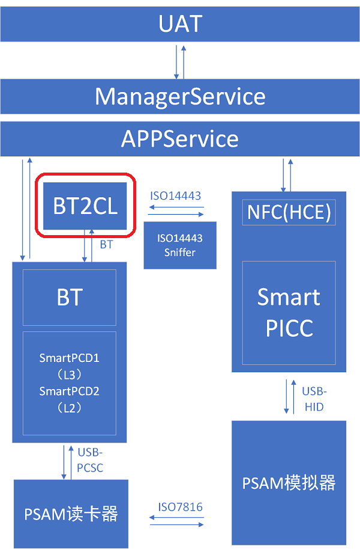
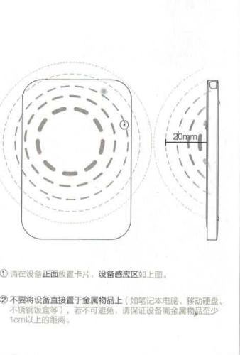
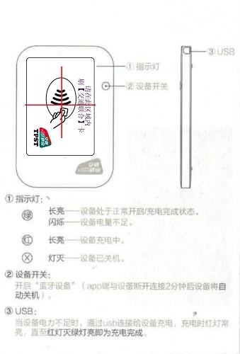

蓝牙非接触读卡器
============================================

设备使用场景
--------------------

	

设备外观
--------------------

	

技术规格
--------------------

.. Note :: 技术规格

.. cssclass:: table-bordered

+--------------------------------------------------------+---------------------------------------------------------------+
| 技术规格                                               | 规格参数                                                      |
+========================================================+===============================================================+
| 尺寸（mm）                                             |70 mm (长) × 50 mm (宽) × 6 mm (高)                            |
+--------------------------------------------------------+---------------------------------------------------------------+
| 重量（g）                                              |60 g（可能有± 5 g偏差）                                        |
+--------------------------------------------------------+---------------------------------------------------------------+
| 电源                                                   |锂离子充电电池（400mAh  ）                                     |
+--------------------------------------------------------+---------------------------------------------------------------+
| USB接口                                                |仅通过USB充电                                                  |
+--------------------------------------------------------+---------------------------------------------------------------+
| 非接触智能卡接口-标准                                  |ISO 14443 A                                                    |
+--------------------------------------------------------+---------------------------------------------------------------+  
| 非接触智能卡接口-协议                                  |符合ISO 14443-4的卡，T=CL                                      |
+--------------------------------------------------------+---------------------------------------------------------------+
| 蓝牙接口-协议                                          |蓝牙® （蓝牙低功耗 / 蓝牙4.1）                                 |
+--------------------------------------------------------+---------------------------------------------------------------+
| LED指示灯                                              |2盏单色灯：绿色 和 红色                                        |
+--------------------------------------------------------+---------------------------------------------------------------+
| 按键                                                   |1个：唤醒蓝牙                                                  |
+--------------------------------------------------------+---------------------------------------------------------------+
| 设备驱动程序支持的操作系统                             |Android™ 4.4及以上版本                                         |
+--------------------------------------------------------+---------------------------------------------------------------+
| 主控模块                                               |nRF51822蓝牙SoC                                                |
+--------------------------------------------------------+---------------------------------------------------------------+
| 读卡距离                                               |0~2cm                                                          |
+--------------------------------------------------------+---------------------------------------------------------------+
| 工作温度                                               |-25摄氏度~50摄氏度                                             |      
+--------------------------------------------------------+---------------------------------------------------------------+