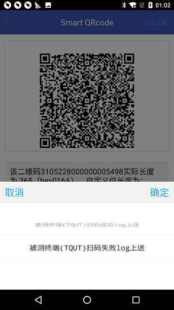

====================================
扫码终端应用软件入网测试作业指导
====================================

文档编号：ZJJK-3000-07

.. cssclass:: table-bordered

+-------------------+---------------------+-------------------------------------------+
| 版本信息          |更新日期             | 变更说明                                  |
+===================+=====================+===========================================+
| ZJJK-3000-07-2019 |2019年7月1日         |初始版本                                   |
+-------------------+---------------------+-------------------------------------------+

Smartqrcode软件使用说明
--------------------------------

Smart qrcode用于模拟成员机构app发码，实现扫码受理终端的扫码交易流程（含白名单）测试。

.. Note :: 在专用手册设备上运行TPSTMobile app.实验室测试人员,需选择实验室测试服务;TPSTMobile付费用户,需选择实验室调试服务.

.. image:: ../_images/app_launcher.png
    :width: 360px
    :height: 640px
	

.. image:: ../_images/select_service.png
    :width: 360px
    :height: 640px
	
.. Note :: 开通指纹登录的用户,直接验证指纹登录.未开通指纹登录用户,输入账号密码登录.

.. image:: ../_images/login_by_fingerprint.png
    :width: 360px
    :height: 640px
	

.. image:: ../_images/gpatmobile_login.png
    :width: 360px
    :height: 640px
	

.. Note :: 选择Smart qrcode功能.在菜单中选择【交易测试】案例编号，工具自动生成相应的qrcode.

.. image:: ../_images/function_select.png
    :width: 360px
    :height: 640px
	

	

	

.. Note :: 被测扫码终端扫描此码，软件判别流程建议与入网测试工具的要求一致.

.. image:: ../_images/gpatmobile_qrcode_caselist.png
    :width: 590px
    :height: 768px
	
	
.. Note :: 被测扫码终端扫描此码，终端判别成功,选择扫码成功log上送.被测扫码终端扫描此码，终端判别失败,选择扫码失败log上送.

	
	

	
	

以下为KernelQ入网测试案例（仅供参考）:

.. warning:: 测试码的时间基准(2021年4月6日执行UTC8入网测试)

.. cssclass:: table-bordered

+---------------+------------------------------------------+-------------------------------------------+-------------------------------+------+------------+------------+-------------+
| 案例编号      |案例描述                                  | 案例说明链接@金卡公司MantisBT             |待测入网PCD预计判别（检票）结果|出错码|建议语音提示|建议嘀声提示|建议LED灯提示|
+===============+==========================================+===========================================+===============================+======+============+============+=============+
|qr0005716      |支持L纠错率                               |https://mantis.t-union.com/view.php?id=5716|待测入网PCD预计判别（检票）结果| 5716 |建议语音提示|建议嘀声提示|建议LED灯提示|   
+---------------+------------------------------------------+-------------------------------------------+-------------------------------+------+------------+------------+-------------+
|qr0005717      |支持M纠错率                               |https://mantis.t-union.com/view.php?id=5717|待测入网PCD预计判别（检票）结果| 5716 |建议语音提示|建议嘀声提示|建议LED灯提示|
+---------------+------------------------------------------+-------------------------------------------+-------------------------------+------+------------+------------+-------------+
|qr0005718      |支持Q纠错率                               |https://mantis.t-union.com/view.php?id=5718|待测入网PCD预计判别（检票）结果| 5716 |建议语音提示|建议嘀声提示|建议LED灯提示|
+---------------+------------------------------------------+-------------------------------------------+-------------------------------+------+------------+------------+-------------+
|qr0005719      |支持H纠错率                               |https://mantis.t-union.com/view.php?id=5719|待测入网PCD预计判别（检票）结果| 5716 |建议语音提示|建议嘀声提示|建议LED灯提示|
+---------------+------------------------------------------+-------------------------------------------+-------------------------------+------+------------+------------+-------------+
|qr0005499      |对字段1（版本号）的识别（非80）           |https://mantis.t-union.com/view.php?id=5499|待测入网PCD预计判别（检票）结果| 5499 |建议语音提示|建议嘀声提示|建议LED灯提示|
+---------------+------------------------------------------+-------------------------------------------+-------------------------------+------+------------+------------+-------------+
|qr0005498      |对字段2（数据长度）的识别                 |https://mantis.t-union.com/view.php?id=5498|待测入网PCD预计判别（检票）结果| xxxx |建议语音提示|建议嘀声提示|建议LED灯提示|
+---------------+------------------------------------------+-------------------------------------------+-------------------------------+------+------------+------------+-------------+
|qr0005500      |对字段2（数据长度）的识别                 |https://mantis.t-union.com/view.php?id=5500|待测入网PCD预计判别（检票）结果| xxxx |建议语音提示|建议嘀声提示|建议LED灯提示|
+---------------+------------------------------------------+-------------------------------------------+-------------------------------+------+------------+------------+-------------+
|qr0005586      |对字段3的识别（证书数据不正确）           |https://mantis.t-union.com/view.php?id=5586|待测入网PCD预计判别（检票）结果| xxxx |建议语音提示|建议嘀声提示|建议LED灯提示|
+---------------+------------------------------------------+-------------------------------------------+-------------------------------+------+------------+------------+-------------+
|qr0005683      |对字段3的识别（与二维码字段06不一致1）    |https://mantis.t-union.com/view.php?id=5683|待测入网PCD预计判别（检票）结果| xxxx |建议语音提示|建议嘀声提示|建议LED灯提示|
+---------------+------------------------------------------+-------------------------------------------+-------------------------------+------+------------+------------+-------------+
|qr0006035      |对字段3的识别（与二维码字段06不一致2）    |https://mantis.t-union.com/view.php?id=6035|待测入网PCD预计判别（检票）结果| xxxx |建议语音提示|建议嘀声提示|建议LED灯提示|
+---------------+------------------------------------------+-------------------------------------------+-------------------------------+------+------------+------------+-------------+
|qr0005754      |对字段3的识别（证书过期失效）             |https://mantis.t-union.com/view.php?id=5754|待测入网PCD预计判别（检票）结果| 5754 |建议语音提示|建议嘀声提示|建议LED灯提示|
+---------------+------------------------------------------+-------------------------------------------+-------------------------------+------+------------+------------+-------------+
|qr0006053      |对字段3的识别（曲线参数非00）             |https://mantis.t-union.com/view.php?id=6053|待测入网PCD预计判别（检票）结果| xxxx |建议语音提示|建议嘀声提示|建议LED灯提示|
+---------------+------------------------------------------+-------------------------------------------+-------------------------------+------+------------+------------+-------------+
|qr0005755      |对字段3的识别（签名算法标识FF）           |https://mantis.t-union.com/view.php?id=5755|待测入网PCD预计判别（检票）结果| xxxx |建议语音提示|建议嘀声提示|建议LED灯提示|
+---------------+------------------------------------------+-------------------------------------------+-------------------------------+------+------------+------------+-------------+
|qr0005756      |对字段3的识别（加密算法标识FF）           |https://mantis.t-union.com/view.php?id=5756|待测入网PCD预计判别（检票）结果| xxxx |建议语音提示|建议嘀声提示|建议LED灯提示|
+---------------+------------------------------------------+-------------------------------------------+-------------------------------+------+------------+------------+-------------+
|qr0006335      |对字段3的识别（服务码不是01010000）       |https://mantis.t-union.com/view.php?id=6335|待测入网PCD预计判别（检票）结果| xxxx |建议语音提示|建议嘀声提示|建议LED灯提示|
+---------------+------------------------------------------+-------------------------------------------+-------------------------------+------+------------+------------+-------------+
|qr0006336      |对字段3的识别（header不是24）             |https://mantis.t-union.com/view.php?id=6336|待测入网PCD预计判别（检票）结果| xxxx |建议语音提示|建议嘀声提示|建议LED灯提示|
+---------------+------------------------------------------+-------------------------------------------+-------------------------------+------+------------+------------+-------------+
|qr0006337      |对字段3的识别（format不是12）             |https://mantis.t-union.com/view.php?id=6337|待测入网PCD预计判别（检票）结果| xxxx |建议语音提示|建议嘀声提示|建议LED灯提示|
+---------------+------------------------------------------+-------------------------------------------+-------------------------------+------+------------+------------+-------------+
|qr0005573      |对字段4（支付账户号）的识别               |https://mantis.t-union.com/view.php?id=5573|待测入网PCD预计判别（检票）结果| xxxx |建议语音提示|建议嘀声提示|建议LED灯提示|
+---------------+------------------------------------------+-------------------------------------------+-------------------------------+------+------------+------------+-------------+
|qr0005574      |对字段5（用户账户号）的识别               |https://mantis.t-union.com/view.php?id=5574|待测入网PCD预计判别（检票）结果| xxxx |建议语音提示|建议嘀声提示|建议LED灯提示|
+---------------+------------------------------------------+-------------------------------------------+-------------------------------+------+------------+------------+-------------+
|qr0005575      |对字段6、7的识别（二维码白名单判别能力）  |https://mantis.t-union.com/view.php?id=5575|待测入网PCD预计判别（检票）结果| xxxx |建议语音提示|建议嘀声提示|建议LED灯提示|
+---------------+------------------------------------------+-------------------------------------------+-------------------------------+------+------------+------------+-------------+
|qr0005576      |对字段6、7的识别（二维码白名单判别能力）  |https://mantis.t-union.com/view.php?id=5576|待测入网PCD预计判别（检票）结果| xxxx |建议语音提示|建议嘀声提示|建议LED灯提示|
+---------------+------------------------------------------+-------------------------------------------+-------------------------------+------+------------+------------+-------------+
|qr0005879      |对字段6、7的识别（二维码白名单判别能力）  |https://mantis.t-union.com/view.php?id=5879|待测入网PCD预计判别（检票）结果| xxxx |建议语音提示|建议嘀声提示|建议LED灯提示|
+---------------+------------------------------------------+-------------------------------------------+-------------------------------+------+------------+------------+-------------+
|qr0005880      |对字段6、7的识别（二维码白名单判别能力）  |https://mantis.t-union.com/view.php?id=5880|待测入网PCD预计判别（检票）结果| xxxx |建议语音提示|建议嘀声提示|建议LED灯提示|
+---------------+------------------------------------------+-------------------------------------------+-------------------------------+------+------------+------------+-------------+
|qr0005577      |对字段8（用户账户类型00）的识别           |https://mantis.t-union.com/view.php?id=5577|待测入网PCD预计判别（检票）结果| xxxx |建议语音提示|建议嘀声提示|建议LED灯提示|
+---------------+------------------------------------------+-------------------------------------------+-------------------------------+------+------------+------------+-------------+
|qr0005760      |对字段8（用户账户类型01）的识别           |https://mantis.t-union.com/view.php?id=5760|待测入网PCD预计判别（检票）结果| xxxx |建议语音提示|建议嘀声提示|建议LED灯提示|
+---------------+------------------------------------------+-------------------------------------------+-------------------------------+------+------------+------------+-------------+
|qr0005761      |对字段8（用户账户类型02）的识别           |https://mantis.t-union.com/view.php?id=5761|待测入网PCD预计判别（检票）结果| xxxx |建议语音提示|建议嘀声提示|建议LED灯提示|
+---------------+------------------------------------------+-------------------------------------------+-------------------------------+------+------------+------------+-------------+
|qr0005762      |对字段8（用户账户类型03）的识别           |https://mantis.t-union.com/view.php?id=5762|待测入网PCD预计判别（检票）结果| xxxx |建议语音提示|建议嘀声提示|建议LED灯提示|
+---------------+------------------------------------------+-------------------------------------------+-------------------------------+------+------------+------------+-------------+
|qr0005764      |对字段8（用户账户类型04）的识别           |https://mantis.t-union.com/view.php?id=5764|待测入网PCD预计判别（检票）结果| xxxx |建议语音提示|建议嘀声提示|建议LED灯提示|
+---------------+------------------------------------------+-------------------------------------------+-------------------------------+------+------------+------------+-------------+
|qr0005765      |对字段8（用户账户类型05）的识别           |https://mantis.t-union.com/view.php?id=5765|待测入网PCD预计判别（检票）结果| xxxx |建议语音提示|建议嘀声提示|建议LED灯提示|
+---------------+------------------------------------------+-------------------------------------------+-------------------------------+------+------------+------------+-------------+
|qr0005578      |对字段9（授权金额上限）的识别             |https://mantis.t-union.com/view.php?id=5578|待测入网PCD预计判别（检票）结果| xxxx |建议语音提示|建议嘀声提示|建议LED灯提示|
+---------------+------------------------------------------+-------------------------------------------+-------------------------------+------+------------+------------+-------------+
|qr0005579      |对字段10（支付账户公钥）的识别            |https://mantis.t-union.com/view.php?id=5579|待测入网PCD预计判别（检票）结果| xxxx |建议语音提示|建议嘀声提示|建议LED灯提示|
+---------------+------------------------------------------+-------------------------------------------+-------------------------------+------+------------+------------+-------------+
|qr0005580      |对字段11（支付账户过期时间）的识别        |https://mantis.t-union.com/view.php?id=5580|待测入网PCD预计判别（检票）结果| xxxx |建议语音提示|建议嘀声提示|建议LED灯提示|
+---------------+------------------------------------------+-------------------------------------------+-------------------------------+------+------------+------------+-------------+
|qr0005501      |对字段12（二维码有效时间）的识别          |https://mantis.t-union.com/view.php?id=5501|待测入网PCD预计判别（检票）结果| xxxx |建议语音提示|建议嘀声提示|建议LED灯提示|
+---------------+------------------------------------------+-------------------------------------------+-------------------------------+------+------------+------------+-------------+
|qr0006046      |对字段12（二维码有效时间）的识别          |https://mantis.t-union.com/view.php?id=6046|待测入网PCD预计判别（检票）结果| xxxx |建议语音提示|建议嘀声提示|建议LED灯提示|
+---------------+------------------------------------------+-------------------------------------------+-------------------------------+------+------------+------------+-------------+
|qr0006047      |对字段12（二维码有效时间）的识别          |https://mantis.t-union.com/view.php?id=6047|待测入网PCD预计判别（检票）结果| xxxx |建议语音提示|建议嘀声提示|建议LED灯提示|
+---------------+------------------------------------------+-------------------------------------------+-------------------------------+------+------------+------------+-------------+
|qr0006042      |对字段12（二维码有效时间）的识别          |https://mantis.t-union.com/view.php?id=6042|待测入网PCD预计判别（检票）结果| xxxx |建议语音提示|建议嘀声提示|建议LED灯提示|
+---------------+------------------------------------------+-------------------------------------------+-------------------------------+------+------------+------------+-------------+
|qr0006043      |对字段12（二维码有效时间）的识别          |https://mantis.t-union.com/view.php?id=6043|待测入网PCD预计判别（检票）结果| xxxx |建议语音提示|建议嘀声提示|建议LED灯提示|
+---------------+------------------------------------------+-------------------------------------------+-------------------------------+------+------------+------------+-------------+
|qr0005728      |对字段13、14（DIY长度和数据）的识别       |https://mantis.t-union.com/view.php?id=5728|待测入网PCD预计判别（检票）结果| xxxx |建议语音提示|建议嘀声提示|建议LED灯提示|
+---------------+------------------------------------------+-------------------------------------------+-------------------------------+------+------------+------------+-------------+
|qr0005581      |对字段13（DIY长度）的识别                 |https://mantis.t-union.com/view.php?id=5581|待测入网PCD预计判别（检票）结果| xxxx |建议语音提示|建议嘀声提示|建议LED灯提示|
+---------------+------------------------------------------+-------------------------------------------+-------------------------------+------+------------+------------+-------------+
|qr0005583      |对字段15（发码机构签名数据）的识别        |https://mantis.t-union.com/view.php?id=5583|待测入网PCD预计判别（检票）结果| xxxx |建议语音提示|建议嘀声提示|建议LED灯提示|
+---------------+------------------------------------------+-------------------------------------------+-------------------------------+------+------------+------------+-------------+
|qr0005584      |对字段16（二维码生成时间）的识别          |https://mantis.t-union.com/view.php?id=5584|待测入网PCD预计判别（检票）结果| xxxx |建议语音提示|建议嘀声提示|建议LED灯提示|
+---------------+------------------------------------------+-------------------------------------------+-------------------------------+------+------------+------------+-------------+
|qr0005757      |对字段16（二维码生成时间）的识别          |https://mantis.t-union.com/view.php?id=5757|待测入网PCD预计判别（检票）结果| xxxx |建议语音提示|建议嘀声提示|建议LED灯提示|
+---------------+------------------------------------------+-------------------------------------------+-------------------------------+------+------------+------------+-------------+
|qr0005585      |对字段17（支付账户签名数据）的识别        |https://mantis.t-union.com/view.php?id=5585|待测入网PCD预计判别（检票）结果| xxxx |建议语音提示|建议嘀声提示|建议LED灯提示|
+---------------+------------------------------------------+-------------------------------------------+-------------------------------+------+------------+------------+-------------+
|qr0005676      |支持变长码DIY长32                         |https://mantis.t-union.com/view.php?id=5676|待测入网PCD预计判别（检票）结果| xxxx |建议语音提示|建议嘀声提示|建议LED灯提示|
+---------------+------------------------------------------+-------------------------------------------+-------------------------------+------+------------+------------+-------------+
|qr0005684      |支持变长码DIY长31                         |https://mantis.t-union.com/view.php?id=5684|待测入网PCD预计判别（检票）结果| xxxx |建议语音提示|建议嘀声提示|建议LED灯提示|
+---------------+------------------------------------------+-------------------------------------------+-------------------------------+------+------------+------------+-------------+
|qr0005685      |支持变长码DIY长30                         |https://mantis.t-union.com/view.php?id=5685|待测入网PCD预计判别（检票）结果| xxxx |建议语音提示|建议嘀声提示|建议LED灯提示|
+---------------+------------------------------------------+-------------------------------------------+-------------------------------+------+------------+------------+-------------+
|qr0005686      |支持变长码DIY长29                         |https://mantis.t-union.com/view.php?id=5686|待测入网PCD预计判别（检票）结果| xxxx |建议语音提示|建议嘀声提示|建议LED灯提示|
+---------------+------------------------------------------+-------------------------------------------+-------------------------------+------+------------+------------+-------------+
|qr0005687      |支持变长码DIY长28                         |https://mantis.t-union.com/view.php?id=5687|待测入网PCD预计判别（检票）结果| xxxx |建议语音提示|建议嘀声提示|建议LED灯提示|
+---------------+------------------------------------------+-------------------------------------------+-------------------------------+------+------------+------------+-------------+
|qr0005688      |支持变长码DIY长27                         |https://mantis.t-union.com/view.php?id=5688|待测入网PCD预计判别（检票）结果| xxxx |建议语音提示|建议嘀声提示|建议LED灯提示|
+---------------+------------------------------------------+-------------------------------------------+-------------------------------+------+------------+------------+-------------+
|qr0005689      |支持变长码DIY长26                         |https://mantis.t-union.com/view.php?id=5689|待测入网PCD预计判别（检票）结果| xxxx |建议语音提示|建议嘀声提示|建议LED灯提示|
+---------------+------------------------------------------+-------------------------------------------+-------------------------------+------+------------+------------+-------------+
|qr0005690      |支持变长码DIY长25                         |https://mantis.t-union.com/view.php?id=5690|待测入网PCD预计判别（检票）结果| xxxx |建议语音提示|建议嘀声提示|建议LED灯提示|
+---------------+------------------------------------------+-------------------------------------------+-------------------------------+------+------------+------------+-------------+
|qr0005691      |支持变长码DIY长24                         |https://mantis.t-union.com/view.php?id=5691|待测入网PCD预计判别（检票）结果| xxxx |建议语音提示|建议嘀声提示|建议LED灯提示|
+---------------+------------------------------------------+-------------------------------------------+-------------------------------+------+------------+------------+-------------+
|qr0005692      |支持变长码DIY长23                         |https://mantis.t-union.com/view.php?id=5692|待测入网PCD预计判别（检票）结果| xxxx |建议语音提示|建议嘀声提示|建议LED灯提示|
+---------------+------------------------------------------+-------------------------------------------+-------------------------------+------+------------+------------+-------------+
|qr0005693      |支持变长码DIY长22                         |https://mantis.t-union.com/view.php?id=5693|待测入网PCD预计判别（检票）结果| xxxx |建议语音提示|建议嘀声提示|建议LED灯提示|
+---------------+------------------------------------------+-------------------------------------------+-------------------------------+------+------------+------------+-------------+
|qr0005694      |支持变长码DIY长21                         |https://mantis.t-union.com/view.php?id=5694|待测入网PCD预计判别（检票）结果| xxxx |建议语音提示|建议嘀声提示|建议LED灯提示|
+---------------+------------------------------------------+-------------------------------------------+-------------------------------+------+------------+------------+-------------+
|qr0005695      |支持变长码DIY长20                         |https://mantis.t-union.com/view.php?id=5695|待测入网PCD预计判别（检票）结果| xxxx |建议语音提示|建议嘀声提示|建议LED灯提示|
+---------------+------------------------------------------+-------------------------------------------+-------------------------------+------+------------+------------+-------------+
|qr0005696      |支持变长码DIY长19                         |https://mantis.t-union.com/view.php?id=5696|待测入网PCD预计判别（检票）结果| xxxx |建议语音提示|建议嘀声提示|建议LED灯提示|
+---------------+------------------------------------------+-------------------------------------------+-------------------------------+------+------------+------------+-------------+
|qr0005697      |支持变长码DIY长18                         |https://mantis.t-union.com/view.php?id=5697|待测入网PCD预计判别（检票）结果| xxxx |建议语音提示|建议嘀声提示|建议LED灯提示|
+---------------+------------------------------------------+-------------------------------------------+-------------------------------+------+------------+------------+-------------+
|qr0005698      |支持变长码DIY长17                         |https://mantis.t-union.com/view.php?id=5698|待测入网PCD预计判别（检票）结果| xxxx |建议语音提示|建议嘀声提示|建议LED灯提示|
+---------------+------------------------------------------+-------------------------------------------+-------------------------------+------+------------+------------+-------------+
|qr0005699      |支持变长码DIY长16                         |https://mantis.t-union.com/view.php?id=5699|待测入网PCD预计判别（检票）结果| xxxx |建议语音提示|建议嘀声提示|建议LED灯提示|
+---------------+------------------------------------------+-------------------------------------------+-------------------------------+------+------------+------------+-------------+
|qr0005700      |支持变长码DIY长15                         |https://mantis.t-union.com/view.php?id=5700|待测入网PCD预计判别（检票）结果| xxxx |建议语音提示|建议嘀声提示|建议LED灯提示|
+---------------+------------------------------------------+-------------------------------------------+-------------------------------+------+------------+------------+-------------+
|qr0005701      |支持变长码DIY长14                         |https://mantis.t-union.com/view.php?id=5701|待测入网PCD预计判别（检票）结果| xxxx |建议语音提示|建议嘀声提示|建议LED灯提示|
+---------------+------------------------------------------+-------------------------------------------+-------------------------------+------+------------+------------+-------------+
|qr0005702      |支持变长码DIY长13                         |https://mantis.t-union.com/view.php?id=5702|待测入网PCD预计判别（检票）结果| xxxx |建议语音提示|建议嘀声提示|建议LED灯提示|
+---------------+------------------------------------------+-------------------------------------------+-------------------------------+------+------------+------------+-------------+
|qr0005703      |支持变长码DIY长12                         |https://mantis.t-union.com/view.php?id=5703|待测入网PCD预计判别（检票）结果| xxxx |建议语音提示|建议嘀声提示|建议LED灯提示|
+---------------+------------------------------------------+-------------------------------------------+-------------------------------+------+------------+------------+-------------+
|qr0005704      |支持变长码DIY长11                         |https://mantis.t-union.com/view.php?id=5704|待测入网PCD预计判别（检票）结果| xxxx |建议语音提示|建议嘀声提示|建议LED灯提示|
+---------------+------------------------------------------+-------------------------------------------+-------------------------------+------+------------+------------+-------------+
|qr0005705      |支持变长码DIY长10                         |https://mantis.t-union.com/view.php?id=5705|待测入网PCD预计判别（检票）结果| xxxx |建议语音提示|建议嘀声提示|建议LED灯提示|
+---------------+------------------------------------------+-------------------------------------------+-------------------------------+------+------------+------------+-------------+
|qr0005706      |支持变长码DIY长09                         |https://mantis.t-union.com/view.php?id=5706|待测入网PCD预计判别（检票）结果| xxxx |建议语音提示|建议嘀声提示|建议LED灯提示|
+---------------+------------------------------------------+-------------------------------------------+-------------------------------+------+------------+------------+-------------+
|qr0005707      |支持变长码DIY长08                         |https://mantis.t-union.com/view.php?id=5707|待测入网PCD预计判别（检票）结果| xxxx |建议语音提示|建议嘀声提示|建议LED灯提示|
+---------------+------------------------------------------+-------------------------------------------+-------------------------------+------+------------+------------+-------------+
|qr0005708      |支持变长码DIY长07                         |https://mantis.t-union.com/view.php?id=5708|待测入网PCD预计判别（检票）结果| xxxx |建议语音提示|建议嘀声提示|建议LED灯提示|
+---------------+------------------------------------------+-------------------------------------------+-------------------------------+------+------------+------------+-------------+
|qr0005709      |支持变长码DIY长06                         |https://mantis.t-union.com/view.php?id=5709|待测入网PCD预计判别（检票）结果| xxxx |建议语音提示|建议嘀声提示|建议LED灯提示|
+---------------+------------------------------------------+-------------------------------------------+-------------------------------+------+------------+------------+-------------+
|qr0005710      |支持变长码DIY长05                         |https://mantis.t-union.com/view.php?id=5710|待测入网PCD预计判别（检票）结果| xxxx |建议语音提示|建议嘀声提示|建议LED灯提示|
+---------------+------------------------------------------+-------------------------------------------+-------------------------------+------+------------+------------+-------------+
|qr0005711      |支持变长码DIY长04                         |https://mantis.t-union.com/view.php?id=5711|待测入网PCD预计判别（检票）结果| xxxx |建议语音提示|建议嘀声提示|建议LED灯提示|
+---------------+------------------------------------------+-------------------------------------------+-------------------------------+------+------------+------------+-------------+
|qr0005712      |支持变长码DIY长03                         |https://mantis.t-union.com/view.php?id=5712|待测入网PCD预计判别（检票）结果| xxxx |建议语音提示|建议嘀声提示|建议LED灯提示|
+---------------+------------------------------------------+-------------------------------------------+-------------------------------+------+------------+------------+-------------+
|qr0005713      |支持变长码DIY长02                         |https://mantis.t-union.com/view.php?id=5713|待测入网PCD预计判别（检票）结果| xxxx |建议语音提示|建议嘀声提示|建议LED灯提示|
+---------------+------------------------------------------+-------------------------------------------+-------------------------------+------+------------+------------+-------------+
|qr0005714      |支持变长码DIY长01                         |https://mantis.t-union.com/view.php?id=5714|待测入网PCD预计判别（检票）结果| xxxx |建议语音提示|建议嘀声提示|建议LED灯提示|
+---------------+------------------------------------------+-------------------------------------------+-------------------------------+------+------------+------------+-------------+
|qr0005715      |支持变长码DIY长00                         |https://mantis.t-union.com/view.php?id=5715|待测入网PCD预计判别（检票）结果| xxxx |建议语音提示|建议嘀声提示|建议LED灯提示|
+---------------+------------------------------------------+-------------------------------------------+-------------------------------+------+------------+------------+-------------+
|qr0005855      |扫码终端支持加载多CA01                    |https://mantis.t-union.com/view.php?id=5855|待测入网PCD预计判别（检票）结果| xxxx |建议语音提示|建议嘀声提示|建议LED灯提示|
+---------------+------------------------------------------+-------------------------------------------+-------------------------------+------+------------+------------+-------------+
|qr0005856      |扫码终端支持加载多CA02                    |https://mantis.t-union.com/view.php?id=5856|待测入网PCD预计判别（检票）结果| xxxx |建议语音提示|建议嘀声提示|建议LED灯提示|
+---------------+------------------------------------------+-------------------------------------------+-------------------------------+------+------------+------------+-------------+
|qr0005744      |扫码终端支持加载多CA03                    |https://mantis.t-union.com/view.php?id=5744|待测入网PCD预计判别（检票）结果| xxxx |建议语音提示|建议嘀声提示|建议LED灯提示|
+---------------+------------------------------------------+-------------------------------------------+-------------------------------+------+------------+------------+-------------+
|qr0005857      |扫码终端支持加载多CA04                    |https://mantis.t-union.com/view.php?id=5857|待测入网PCD预计判别（检票）结果| xxxx |建议语音提示|建议嘀声提示|建议LED灯提示|
+---------------+------------------------------------------+-------------------------------------------+-------------------------------+------+------------+------------+-------------+
|qr0006048      |扫码终端支持加载多CA05(不加载)            |https://mantis.t-union.com/view.php?id=6048|待测入网PCD预计判别（检票）结果| xxxx |建议语音提示|建议嘀声提示|建议LED灯提示|
+---------------+------------------------------------------+-------------------------------------------+-------------------------------+------+------------+------------+-------------+
                                                                                                        

.. Note :: 完成交易流程测试后，再完成【白名单测试】，白名单内的测试案例，终端应交易成功（0余额的qrcode应提示0余额或报出错码5165）；白名单内（字段6机构代码和字段3卡IIN不一致的测试案例）终端应拒绝交易报出错码5683；白名单外的案例终端应拒绝交易报出错码5575；.

	

