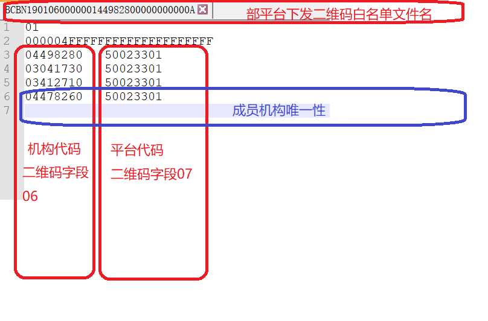

================================
扫码终端入网送检指南
================================

文档编号：ZJJK-3000-15

.. Note :: 被测扫码终端需加载如下测试根CA【国密算法二维码】

国密算法测试根CA01下载：https://tpstmobile.t-union.com/release/01010000.JG01

公钥值：F8ECFA98612ECB5CF9C0EBCAA8C9C67714F6EE948CFF7226EF7E39000542930FBEA4C6CEF060C660ED51C93EBD11696208373792096609CDDA3C7726B563B50F

国密算法测试根CA02下载：https://tpstmobile.t-union.com/release/01010000.JG02

公钥值：DCB53B215317DD87EAC919EEA6524085CACF49E37CF055B0B6C0AA84D8157F496F32BFD10BEF202CDD897FA8E6172F2F14E3CA810FED8089702CB61277690C6C

国密算法测试根CA03下载：https://tpstmobile.t-union.com/release/01010000.JG03

公钥值：2DFC1F549DD80F6EE6A773F8F5CC1A7A20684E1FB9AA48B743CE04A87730913C81BE6D8B4F1DB8FFBEDDA49C45717665436623861CBDBD56D6548D79882314A6

国密算法测试根CA04下载：https://tpstmobile.t-union.com/release/01010000.JG04

公钥值：30ECE34EE88ABA65F81A09F8BE88C5B25E420093F46CB32C875795F6D222DBB4C246A67BEC7D29545E1601C6E9BF97309CA96D6F37D02E4B5138CCD6B8E987E9

国密算法测试根CA05下载：https://tpstmobile.t-union.com/release/01010000.JG05

公钥值：BEFE0BF57648D84FBFAE4BE6A4EE9824ACE8BC3AF63876B07BAF79689091FCF17167D47C2C29427010A96865B6A0AC440CF108860E5829E30165551DB08CD8F2

.. warning:: 国密算法正式根CA请向交通联合成员机构索取

.. Note :: 被测扫码终端需连接至【测试平台】并加载二维码业务白名单，白名单应最小包含如下机构：

qr0327(发码平台1):00083010 /50083010

qr0330(自发码平台):01011000 /01011000

qr2058(发码平台2):01523990 /50023301

qr0320(发码平台2):09981001 /50023301

本地码参数：自有码字段6/自有码字段7

白名单文件格式参考下图

	
白名单文件sample下载：https://tpstmobile.t-union.com/release/qrcodesample	

.. Note :: 联系金卡检测实验室（电话：010-65290121）签署委托测试合同、填写OA检测任务委托及被测件流转单，提交入网测试样品

