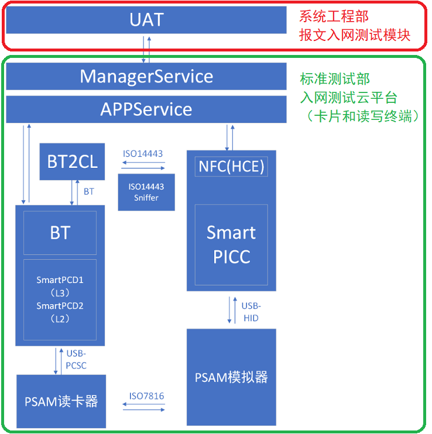
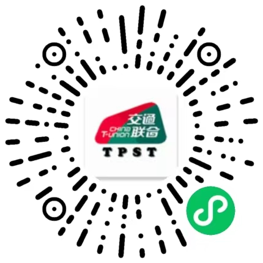

.. niftools_sphinx_theme documentation master file, created by
   sphinx-quickstart on Tue Sep 12 07:25:47 2017.
   You can adapt this file completely to your liking, but it should at least
   contain the root `toctree` directive.

技术服务
============================== 

L1、L2、L3层次关系说明
---------------------------------- 

.. image:: _images/l1l2l3.png
    :width: 938px
    :height: 475px

.. Tip:: 卡片应用软件测试L1-L2-L3层次关系说明

.. cssclass:: table-bordered

+-------------------+---------------------+---------------------+----------------------------------------------------+
| OSI开放式互联模型 |依据标准             |等效标准             |提供第三方服务的实验室                              |
+===================+=====================+=====================+====================================================+
|L1物理(电气特性)层 |JT/T-1356.3          |NFC forum type-A     |认证检测签约实验室相关信息                          |
+-------------------+---------------------+---------------------+----------------------------------------------------+
|L1协议层           |JT/T-1356.3          |NFC forum type-A     |认证检测签约实验室相关信息                          |
+-------------------+---------------------+---------------------+----------------------------------------------------+
|L2应用层           |JT/T-1356.1          |                     |认证检测签约实验室相关信息                          |
+-------------------+---------------------+---------------------+----------------------------------------------------+
|L3卡片入网个人化   |JT/T-987.2           |                     |北京中交金卡科技有限公司检测实验室                  |
+-------------------+---------------------+---------------------+----------------------------------------------------+

.. Tip:: 读写终端应用软件测试L1-L2-L3层次关系说明

.. cssclass:: table-bordered

+-------------------+---------------------+---------------------+----------------------------------------------------+
| OSI开放式互联模型 |依据标准             |等效标准             |提供第三方服务的实验室                              |
+===================+=====================+=====================+====================================================+
|L1物理(电气特性)层 |JT/T-1356.4          |                     |认证检测签约实验室相关信息                          |
+-------------------+---------------------+---------------------+----------------------------------------------------+
|L1协议层           |JT/T-1356.4          |                     |认证检测签约实验室相关信息                          |
+-------------------+---------------------+---------------------+----------------------------------------------------+
|L2应用层           |JT/T-1356.2          |                     |认证检测签约实验室相关信息                          |
+-------------------+---------------------+---------------------+----------------------------------------------------+
|L3终端应用软件入网 |JT/T-987.3           |                     |北京中交金卡科技有限公司检测实验室                  |
+-------------------+---------------------+---------------------+----------------------------------------------------+

 
入网测试云平台L3入网测试说明
---------------------------------- 

实验室自主开发和维护入网测试云平台服务系统，配合系统工程部的报文入网测试模块，可为交通联合卡组织成员机构(Issuer类)、卡片厂商(Picc类)、读写终端厂商(Pcd类)、一卡通系统集成厂商等提供专业化的互联互通入网测试服务(L3)和技术咨询服务。

 
卡片应用软件(L3)入网测试服务
----------------------------------

实验室提供卡片应用软件(L3)入网测试服务，通过 - SmartPCD2，配合便携式智能手持设备模拟云POS功能，实现PICC卡片应用软件入网测试。

.. toctree::
   :maxdepth: 1
   
   cardprofile/README
   smartpcd/README
   tpstmobile/README-CUT
   smartpcd/REPORT
   
 
读写终端应用软件(L3)入网测试服务
----------------------------------

实验室提供读写终端(L3)入网测试服务，通过 - SmartPICC，配合便携式智能手持设备模拟不同卡片特征值条件下的非接卡片应用，实现读写终端入网入网测试。

.. toctree::
   :maxdepth: 1
   
   terminalsetting/README
   smartpicc/README
   tpstmobile/README-TPUT
   smartpicc/REPORT

互联互通报文(L3)入网测试
----------------------------------

实验室提供互联互通报文(L3)入网测试

.. toctree::
   :maxdepth: 1
   
   iso8583/ISO8583
   iso8583/REPORT
    
   
L2校准服务
----------------------------------
实验室提供JT/T 1356.1 - 2020 和 JT/T 1356.2 - 2020 校准服务

.. toctree::
   :maxdepth: 1
   
   calibration/README

二维码数据入网测试
----------------------------------
 
实验室提供二维码数据入网测试服务，通过 - SmartScan，配合便携式智能手持设备（main camera）识别和解析qrcode数据，完成签名验签功能，支持KQ。

.. toctree::
   :maxdepth: 1
   
   genqrcode/README
   smartscan/README
   tpstmobile/README-QUT
   smartscan/REPORT
   
扫码终端入网测试服务
----------------------------------

实验室提供扫码终端入网测试服务，通过 - SmartQrcode，配合便携式智能手持设备模拟不同数据条件生成的qrcode，实现qrcode扫码设备的KQ软件判别测试。

.. toctree::
   :maxdepth: 1
   
   scanterminalsetting/README
   qrcode/README
   tpstmobile/README-TQUT
   qrcode/REPORT
   

测试CA签发服务
----------------

实验室提供测试CA签发服务，通过 - SmartCA，配合便携式智能手持设备对电子现金业务和qrcode业务的CA证书请求文件ITNP/IGNP签发

.. toctree::
   :maxdepth: 1
   
   smartCA/README

VPN服务
----------------
   
实验室VPN服务，配合便携式智能手持设备上送实验室测试原始记录

.. toctree::
   :maxdepth: 1
   
   inode/README
   

APDU指令分析服务
---------------- 
实验室提供APDU指令分析服务

.. toctree::
   :maxdepth: 1
   
   spy/README

白名单加载测试服务和手机兼容性测试服务
------------------------------------------------ 

实验室提供白名单加载测试服务和手机兼容性测试服务，请在确定安全的条件下
用微信扫描小程序邀请码,配合不同型号的NFC手机模拟不同成员机构特征值的虚
拟卡片应用，实现NFC手机和PCD的兼容性测试和PCD设备加载的K1、K2白名单判
别测试。请扫码体验实验室云测试微信小程序。

.. Tip:: NFC手机虚拟卡兼容性测试

.. cssclass:: table-bordered

+-------------------+-----------------------+----------------------------+------------------------------------+
| OSI开放式互联模型 |依据标准               |测试方法                    |提供第三方服务的实验室              |
+===================+=======================+============================+====================================+
|L3兼容性(测试密钥) |JT/T-987.7             |使用TPSTMobile或微信小程序  |建议一卡通收单服务机构组织实施      |
+-------------------+-----------------------+----------------------------+------------------------------------+
|L3兼容性(正式密钥) |JT/T-987.7             |使用相应的支付程序          |建议一卡通收单服务机构组织实施      |
+-------------------+-----------------------+----------------------------+------------------------------------+

	

.. toctree::
   :maxdepth: 1

   wechat/README
   whiteList/README
   IOT/README

测试PSAM远程个人化服务
----------------------------------

实验室提供测试PSAM远程个人化服务

.. toctree::
   :maxdepth: 1

   Psamperso/README

测试PICC远程个人化服务
----------------------------------
   
实验室提供测试PICC远程个人化服务

.. toctree::
   :maxdepth: 1

   CLperso/README
   

云测试（调试）服务
----------------------------------

实验室为成员机构提供预约入网测试服务，为卡片厂家和终端厂家提供入网调试服务

.. toctree::
   :maxdepth: 1
   
   tpstmobile/README
  