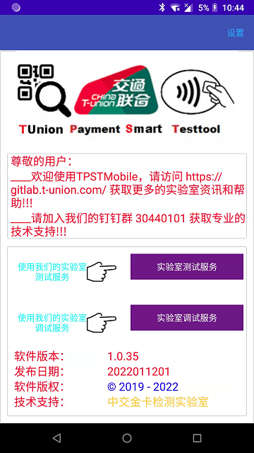
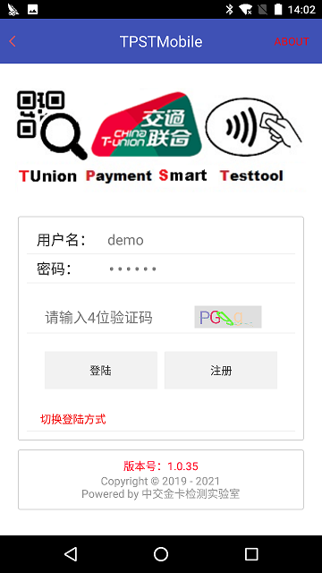

=================
测试CA签发服务
=================

文档编号：ZJJK-3000-08

.. cssclass:: table-bordered

+-------------------+---------------------+-------------------------------------------+
| 版本信息          |更新日期             | 变更说明                                  |
+===================+=====================+===========================================+
| ZJJK-3000-08-2019 |2019年7月1日         |初始版本                                   |
+-------------------+---------------------+-------------------------------------------+

SmartCA软件使用说明
~~~~~~~~~~~~~~~~~~~~~~~~~~~~~~~~~~~~~~~~~~~

SmartCA用于签发机构测试qrcode证书和电子现金证书。

.. Note :: 在专用手册设备上运行TPSTMobile app.

.. image:: ../_images/app_launcher.png
    :width: 360px
    :height: 640px
	
.. Note :: 实验室测试人员,需选择实验室测试服务;TPSTMobile付费用户,需选择实验室调试服务.

	
.. Note :: 开通指纹登录的用户,直接验证指纹登录.

.. image:: ../_images/login_by_fingerprint.png
    :width: 360px
    :height: 640px
	
.. Note :: 未开通指纹登录用户,输入账号密码登录.

	

.. Note :: 选择SmartCA功能

.. image:: ../_images/function_select.png
    :width: 430px
    :height: 730px
	

.. Note :: 在菜单中选择qrcode证书签发，进入签发界面

	

.. Note :: 在对话框中使用ES文件管理器选择要签发的qrcode IGNP请求文件

参考以下格式生成国密qrcode IGNP请求文件

	
.. warning:: qrcode IGNP请求文件需通过相关格式检查和数据验签，IGNP请求文件格式检查工具下载：https://gitlab.t-union.com/tpstmobile/release/-/raw/master/tunion_ignp_test.7z

.. Note :: 选好qrcode IGNP请求文件后，选择【签发】，程序将签好的机构证书文件和对应的测试CA文件下载到指定文件夹

	

.. Note :: 在菜单中选择电子现金国密证书签发，进入签发界面

	

.. Note :: 在对话框中使用ES文件管理器选择要签发的国密电子现金IGNP请求文件

参考以下格式生成国密电子现金IGNP请求文件

.. warning:: 国密电子现金IGNP请求文件需通过相关格式检查和数据验签，IGNP请求文件格式检查工具下载：https://gitlab.t-union.com/tpstmobile/release/-/raw/master/tunion_ignp_test.7z
	
	

.. Note :: 选好国密电子现金IGNP请求文件后，选择【签发】，程序将签好的机构证书文件和对应的测试CA文件下载到指定文件夹

	

.. Note :: 在菜单中选择电子现金国际证书签发，进入签发界面

	

.. Note :: 在对话框中使用ES文件管理器选择要签发的国际电子现金ITNP请求文件

参考以下格式生成国际电子现金ITNP请求文件

.. warning:: 国际电子现金ITNP请求文件需通过相关格式检查和数据验签，ITNP请求文件格式检查工具下载：https://gitlab.t-union.com/tpstmobile/release/-/raw/master/tunion_itnp_test.7z
	

.. Note :: 选好国际电子现金ITNP请求文件后，选择【签发】，程序将签好的机构证书文件和对应的测试CA文件下载到指定文件夹

	

