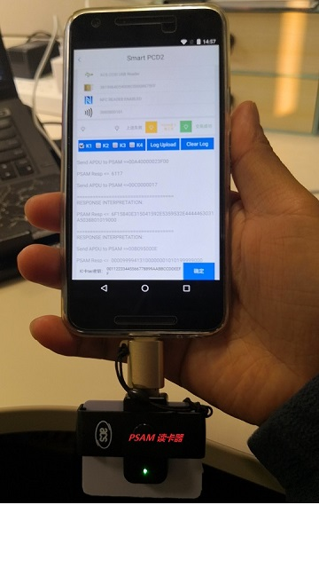
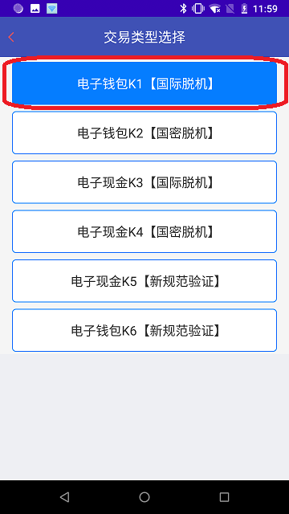
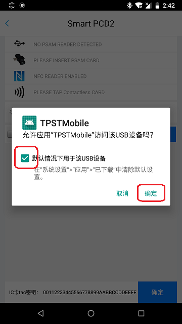
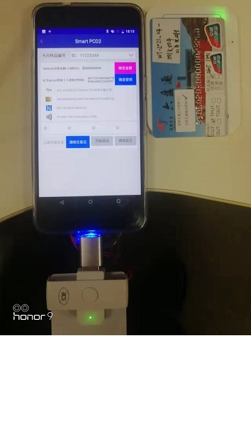
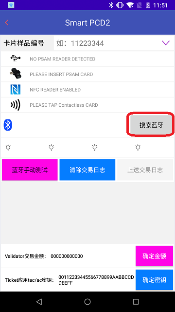
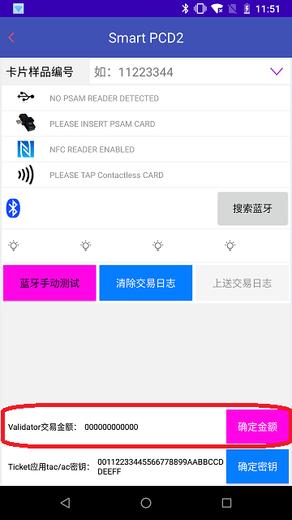
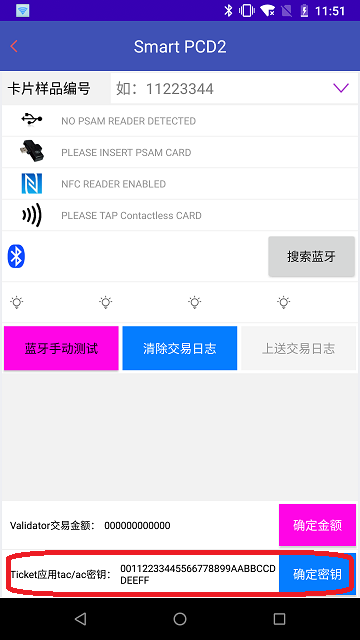
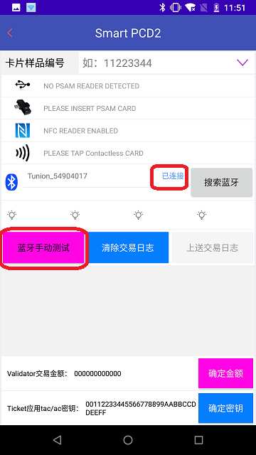
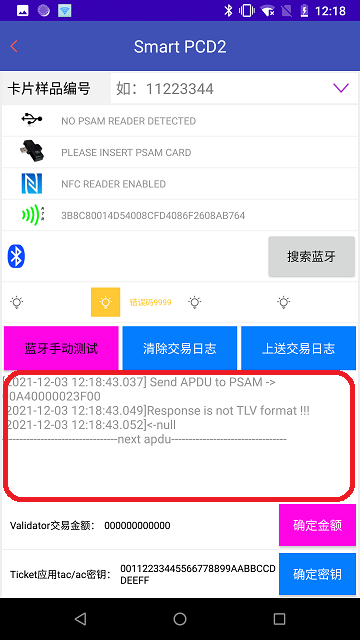
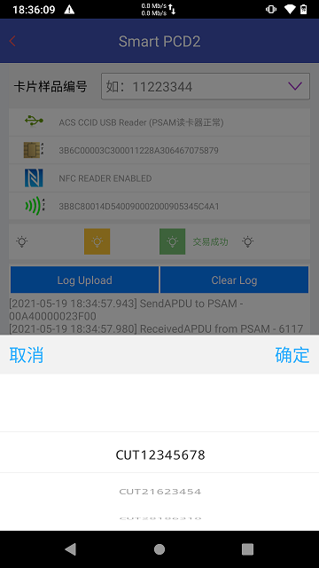

================================
卡片应用入网测试作业指导
================================

文档编号：ZJJK-3000-02

.. cssclass:: table-bordered

+-------------------+---------------------+-------------------------------------------+
| 版本信息          |更新日期             | 变更说明                                  |
+===================+=====================+===========================================+
| ZJJK-3000-02-2019 |2019年7月1日         |初始版本                                   |
+-------------------+---------------------+-------------------------------------------+

SmartPCD2软件使用说明
----------------------------------

.. Note :: 在专用手持设备上运行TPSTMobile app，实验室测试人员,需选择实验室测试服务;TPSTMobile付费用户,需选择实验室调试服务.

.. image:: ../_images/app_launcher.png
    :width: 360px
    :height: 640px

.. image:: ../_images/select_service.png
    :width: 360px
    :height: 640px
	
.. Note :: 开通指纹登录的用户,直接验证指纹登录;不支持指纹登录的设备，输入账号密码登录;

.. image:: ../_images/login_by_fingerprint.png
    :width: 360px
    :height: 640px
	

.. image:: ../_images/TPSTMobile_login_UI.png
    :width: 360px
    :height: 640px
	
	
	

.. Note :: 使用NFC作为读卡器,请按照下图连接好PSAM读卡器并放置好PSAM,在模块选择界面选择SmartPCD2.

	

.. image:: ../_images/function_select.png
    :width: 360px
    :height: 640px
	
	
.. Note :: 选择下面交易类型

K1：脱机电子钱包（国际算法）

K2：脱机电子钱包（国密算法）

K3：脱机电子现金（国际算法）

K4：脱机电子现金（国密算法）

K5：脱机电子现金新规范验证（国密算法）

K6：脱机电子钱包新规范验证（国密算法）

进入模块主界面，如驱动加载正常，应有PSAM读卡器识别成功的提示信息，勾选【默认情况下用于该USB设备】再选择【确定】.

	
	
.. Note :: 使用蓝牙读卡器,请按照下图放置蓝牙读卡器,连接好PSAM读卡器并放置好PSAM,在模块选择界面选择要测试的kernel,进入测试主界面,再按【搜索蓝牙】按键

.. warning:: 如遇到蓝牙读卡器搜索不到的情况，请重新开关手持设备蓝牙再次搜索

.. Note :: 在SmartPCD2界面下设置好交易金额(默认为0元交易),设置好对应卡片的TAC密钥或AC密文.

	
.. Note :: 如使用蓝牙读卡器模式,点选蓝牙读卡器ID建立连接,连接成功后,将被测样品（CUT12345678）放置于蓝牙读卡器天线区,选择【蓝牙手动测试】按键,【黄/绿/红：虚拟指示灯】走马灯式闪烁.

.. image:: ../_images/BT_connect.png
    :width: 360px
    :height: 640px

.. Note :: 如使用NFC读卡器模式,在SmartPCD2界面下设置好被测样品（CUT12345678）,将CUT放置于手持设备的NFC读卡区，测试自动开始，【黄/绿/红】走马灯式闪烁.

指示灯从左至右的顺序为:【蓝色灯】 【黄色灯】 【绿色灯】 【红色灯】

【黄色灯】常亮表示PSAM卡读写失败，在黄灯显示区显示PSAM卡读写出错码

【绿色灯】常亮表示卡片交易（结束）成功

【红色灯】常亮表示PICC卡读写失败，在红灯显示区显示PICC卡读写出错码

.. warning:: 【黄/绿/红】走马灯式闪烁表示测试进行中，此时不要从测试设备天线区移除非接触卡片，待绿灯指示灯常亮时，才可以移除非接触卡片，但需等待测试软件收集测试log并显示；

【APDU log 显示区】可查看具体异常的APDU指令

	

	
.. Note :: 交易（结束）成功后，选择样品编号，选择完成后上传卡片业务交易相关信息并验证TAC或TC.

【蓝色灯】常亮表示交易记录上传成功（TAC/TC验证成功）,否则在蓝灯显示区显示系统下发的出错码和相应提示

.. image:: ../_images/pcd2upload.png
    :width: 360px
    :height: 640px

PICC卡片应用入网(kernel1特征值)
----------------------------------
.. toctree::
   :maxdepth: 1
   
   ../carddata1/README  
   
PICC卡片应用入网(kernel2特征值)
----------------------------------   
.. toctree::
   :maxdepth: 1
   

   ../carddata2/README 
   
PICC卡片应用入网(kernel3特征值)
----------------------------------
.. toctree::
   :maxdepth: 1
   
   ../carddata3/README   
 
PICC卡片应用入网(kernel4特征值)
---------------------------------- 
.. toctree::
   :maxdepth: 1  
   
   ../carddata4/README  
   
PICC卡片应用入网(kernel5特征值)
----------------------------------
.. toctree::
   :maxdepth: 1
 
   ../carddata5/README   

PICC卡片应用入网(kernel6特征值)
----------------------------------
.. toctree::
   :maxdepth: 1
   
   ../carddata6/README    

