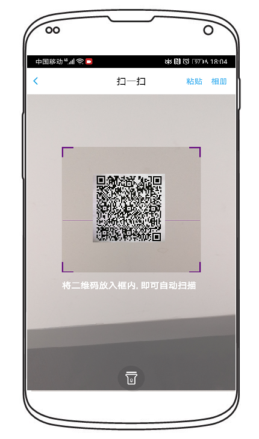
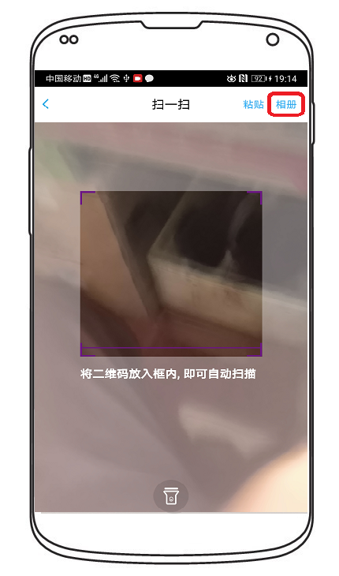
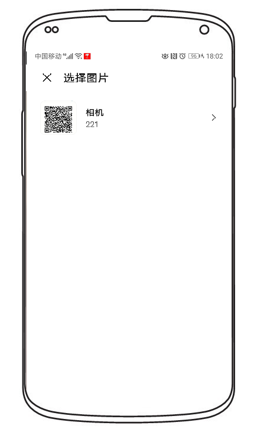
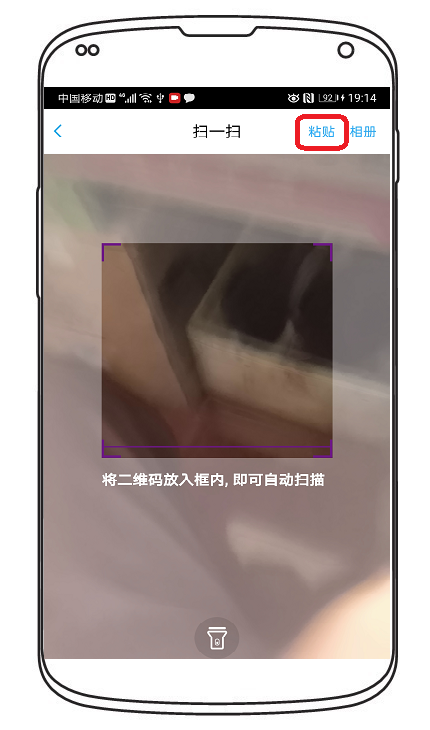
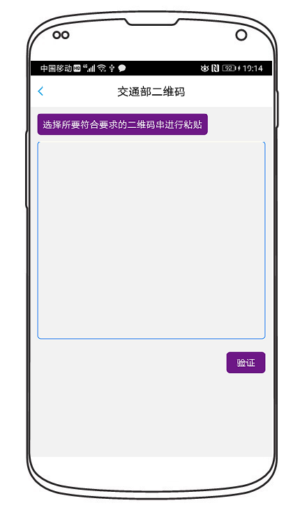
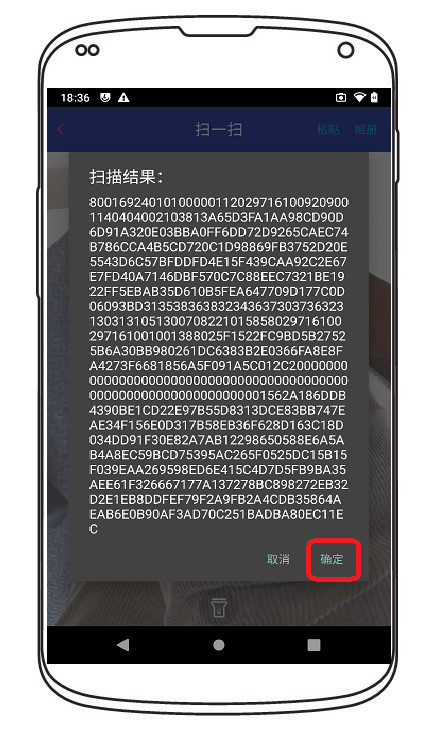
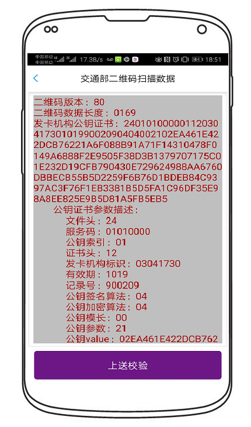

=========================
二维码入网测试作业指导
=========================

文档编号：ZJJK-3000-01

.. cssclass:: table-bordered

+-------------------+---------------------+-------------------------------------------+
| 版本信息          |更新日期             | 变更说明                                  |
+===================+=====================+===========================================+
| ZJJK-3000-01-2019 |2019年7月1日         |初始版本                                   |
+-------------------+---------------------+-------------------------------------------+

SmartScan软件使用说明
~~~~~~~~~~~~~~~~~~~~~~~~~~~~~~~~~~~~~~~~~~~

Smart Scan用于检查成员机构app发码数据

.. Note :: 在专用手册设备上运行TPSTMobile app.实验室测试人员,需选择实验室测试服务;TPSTMobile付费用户,需选择实验室调试服务.

.. image:: ../_images/app_launcher.png
    :width: 360px
    :height: 640px
	

.. image:: ../_images/select_service.png
    :width: 360px
    :height: 640px
	
.. Note :: 开通指纹登录的用户,直接验证指纹登录.未开通指纹登录用户,输入账号密码登录.

.. image:: ../_images/login_by_fingerprint.png
    :width: 360px
    :height: 640px
	

.. image:: ../_images/gpatmobile_login.png
    :width: 360px
    :height: 640px
	

.. Note :: 选择SmartScan.使用【摄像头扫码】模式,将被测码图案放置扫码模摄像头正上方5-10cm处，使qrcode占据60%，等待进行扫码解析

.. warning:: 如扫码闪退或长时间没反应，请调整扫码摄像头与被扫二维码之间距离，使成像码的大小在扫描区如下图所示，可以获得较好的扫码效果

.. image:: ../_images/function_select.png
    :width: 360px
    :height: 640px
	
	

	

	

.. Note :: 或使用【相册】模式,在工具相册应用中选择要测试的二维码图片

	
	

	
	

.. Note :: 或使用【粘贴HEX数据】模式,直接【粘贴】输入二维码HEX数据，再选择【验证】

	

	

.. Note :: qrcode数据识别成功后，在UI中显示扫码结果HEX串,再选择【确定】,按照交通部标准二维码进行字段解析，用户选择【上送校验】，结果将上送至后台验证3次签名（字段3、15、17）数据和其他字段业务规则检查（管理台有配置好字段3-字段9）

	

	
	
	
	

.. Note :: 对于变长二维码（0x0149-0x0169）二维码数据识别案例参考如下：

.. cssclass:: table-bordered

+---------------+----------------------------------+-------------------------------------------+
| 案例编号      |案例描述                          | 案例说明链接@金卡公司MantisBT             |
+===============+==================================+===========================================+
| QUT0005157    |字段1版本号识别（80）             |https://mantis.t-union.com/view.php?id=5157|
+---------------+----------------------------------+-------------------------------------------+
| QUT0005158    |字段2数据长度识别(HEX0149-HEX0169)|https://mantis.t-union.com/view.php?id=5158|
+---------------+----------------------------------+-------------------------------------------+
| QUT0005159    |字段3发卡机构公钥证书识别         |https://mantis.t-union.com/view.php?id=5159|
+---------------+----------------------------------+-------------------------------------------+
| QUT0005170    |字段4用户支付账户号               |https://mantis.t-union.com/view.php?id=5170|
+---------------+----------------------------------+-------------------------------------------+
| QUT0005169    |字段5用户主账户号                 |https://mantis.t-union.com/view.php?id=5169|
+---------------+----------------------------------+-------------------------------------------+
| QUT0005168    |字段6发卡机构代码                 |https://mantis.t-union.com/view.php?id=5168|
+---------------+----------------------------------+-------------------------------------------+
| QUT0005167    |字段7发码平台编号                 |https://mantis.t-union.com/view.php?id=5167|
+---------------+----------------------------------+-------------------------------------------+
| QUT0005166    |字段8账户类型                     |https://mantis.t-union.com/view.php?id=5166|
+---------------+----------------------------------+-------------------------------------------+
| QUT0005165    |字段9单次交易上限                 |https://mantis.t-union.com/view.php?id=5165|
+---------------+----------------------------------+-------------------------------------------+
| QUT0005164    |字段11支付系统过期时间(UTC0时间)  |https://mantis.t-union.com/view.php?id=5164|
+---------------+----------------------------------+-------------------------------------------+
| QUT0005163    |字段12码有效时间（需小于300s）    |https://mantis.t-union.com/view.php?id=5163|
+---------------+----------------------------------+-------------------------------------------+
| QUT0005162    |字段13-14推荐按32个字节填充DIY数据|https://mantis.t-union.com/view.php?id=5162|
+---------------+----------------------------------+-------------------------------------------+
| QUT0005151    |字段10支付账户公钥压缩解压        |https://mantis.t-union.com/view.php?id=5151|
+---------------+----------------------------------+-------------------------------------------+
| QUT0005152    |字段15发卡机构签名                |https://mantis.t-union.com/view.php?id=5152|
+---------------+----------------------------------+-------------------------------------------+
| QUT0005161    |字段16码生成时间(UTC0时间)        |https://mantis.t-union.com/view.php?id=5161|
+---------------+----------------------------------+-------------------------------------------+
| QUT0005160    |字段17支付账户签名                |https://mantis.t-union.com/view.php?id=5160|
+---------------+----------------------------------+-------------------------------------------+

