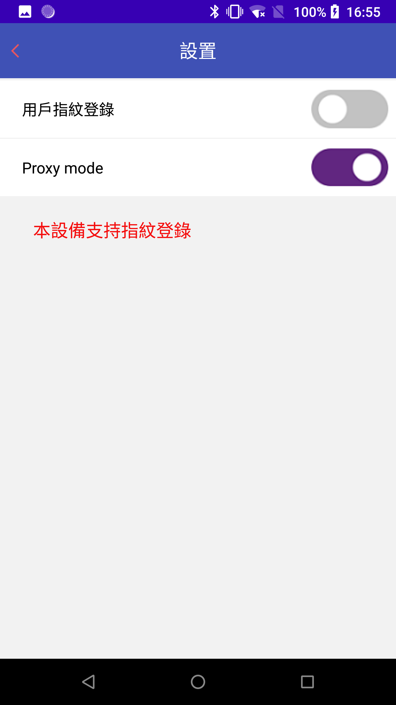
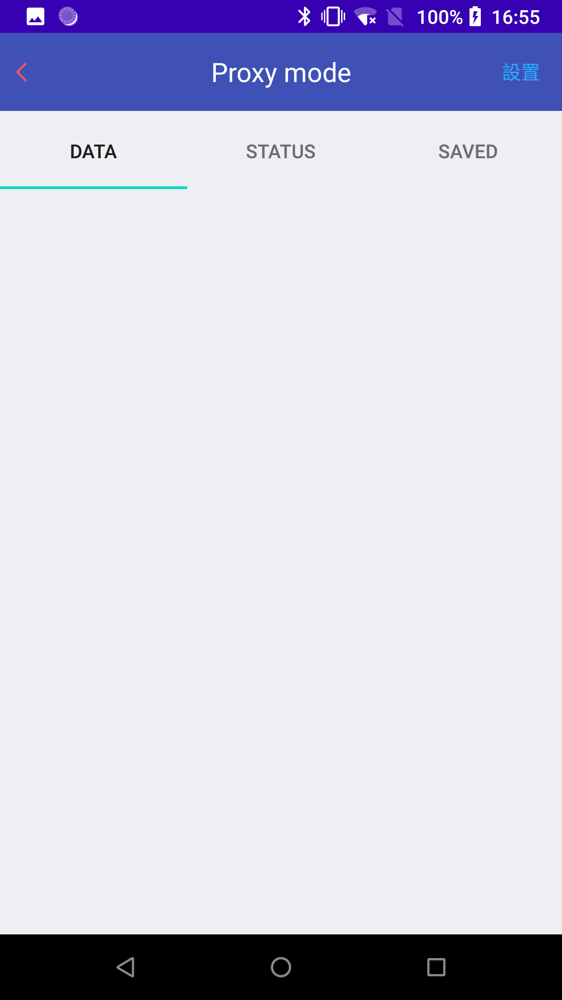
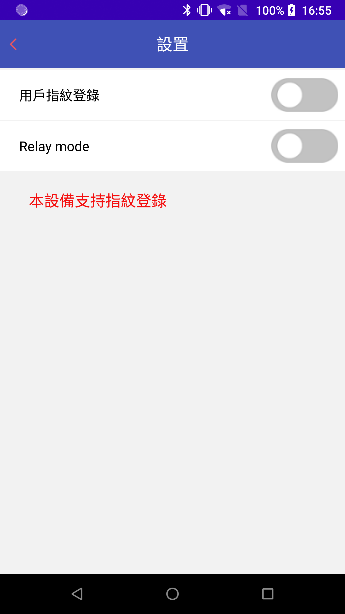
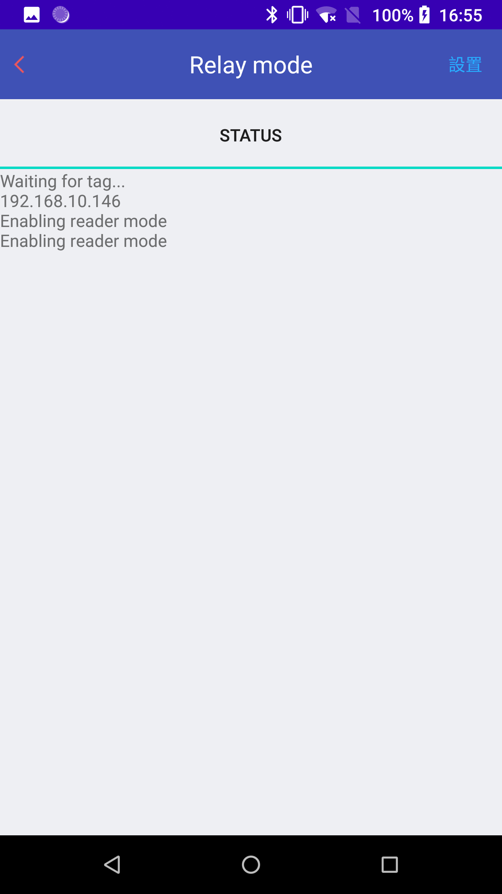

=================================
APDU指令分析服务
=================================

文档编号:ZJJK-3000-05

.. cssclass:: table-bordered

+-------------------+---------------------+-------------------------------------------+
| 版本信息          |更新日期             | 变更说明                                  |
+===================+=====================+===========================================+
| ZJJK-3000-05-2019 |2019年7月1日         |初始版本                                   |
+-------------------+---------------------+-------------------------------------------+
| ZJJK-3000-05-2021 |2021年9月9日         |调整案例说明链接                           |
+-------------------+---------------------+-------------------------------------------+

SmartSpy实现框架
-------------------------------

.. Note :: SmartSpy实现框架

.. mermaid::

   sequenceDiagram
    participant PICC
	participant SmartSpy(Relay)
    participant SmartSpy(Proxy)
    participant Validator
    participant PSAM

	
	
	loop HCE
        Validator-->>Validator:本地交易流程初始化
    end
	
	Validator->>SmartSpy(Proxy):票卡应用选择请求
	
		SmartSpy(Proxy)-->>SmartSpy(Relay):票卡应用选择请求
		
			SmartSpy(Relay)->>PICC:票卡应用选择请求
				
			PICC->>SmartSpy(Relay):票卡应用选择响应
				
		SmartSpy(Relay)-->>SmartSpy(Proxy):票卡应用选择响应
	
	SmartSpy(Proxy)->>Validator:票卡应用选择响应
	
	Validator->>SmartSpy(Proxy):票卡应用指令1请求
	
		SmartSpy(Proxy)-->>SmartSpy(Relay):票卡应用指令1请求
		
			SmartSpy(Relay)->>PICC:票卡应用指令1请求
				
			PICC->>SmartSpy(Relay):票卡应用指令1响应
				
		SmartSpy(Relay)-->>SmartSpy(Proxy):票卡应用指令1响应
	
	SmartSpy(Proxy)->>Validator:票卡应用指令1响应
	
	
	Validator->>PSAM:PSAM应用辅助验证请求
	
	PSAM->>Validator:PSAM应用辅助验证响应
	
	
	
	Validator->>SmartSpy(Proxy):票卡应用指令n请求
	
		SmartSpy(Proxy)-->>SmartSpy(Relay):票卡应用指令n请求
		
			SmartSpy(Relay)->>PICC:票卡应用指令n请求
				
			PICC->>SmartSpy(Relay):票卡应用指令n响应
				
		SmartSpy(Relay)-->>SmartSpy(Proxy):票卡应用指令n响应
	
	SmartSpy(Proxy)->>Validator:票卡应用指令n响应

SmartSpy软件proxy模式使用说明
----------------------------------------

.. Note :: 在专用手持设备上安装运行TPSTMobile应用,选择【设置】menu，设置proxy模式.

	
.. Note :: ,选择SmartSpy模块.

.. image:: ../_images/function_select.png
    :width: 360px
    :height: 640px	
	
.. Note :: 进入proxy模式.

SmartSpy软件relay模式使用说明
----------------------------------------

.. Note :: 在专用手持设备上安装运行TPSTMobile应用,选择【设置】menu，设置relay模式.

	
.. Note :: ,选择SmartSpy模块.

.. image:: ../_images/function_select.png
    :width: 360px
    :height: 640px	
	
.. Note :: 进入proxy模式.

APDU的几种模式说明
----------------------------------------

.. Note :: 参考APDU的几种模式说明

.. toctree::
   :maxdepth: 1
   
   APDU

   

