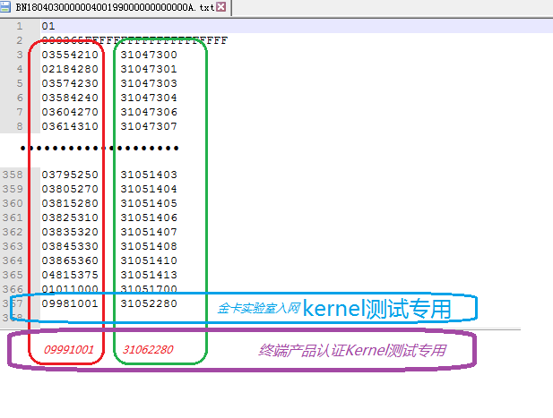

================================
刷卡终端入网送检指南
================================

文档编号：ZJJK-3000-04

.. Note :: 被测刷卡终端需加载如下测试根CA【国际算法电子现金/国密算法电子现金】、放置测试PSAM【仅国际/仅国密/双算法】

国际算法测试根CA08下载：https://tpstmobile.t-union.com/release/01010000.JT08

国际算法测试根CA08公钥值：D331A5C2B5AFE0F566F4483E5DA73A98C608B05D5031B1EC040475404ECD3478285D1D8E2BE2523CEDCE7664F9206FCD37B6F70E9124F61A3AFC26F9A3367F23539C3F776BD0D0A3490E0AEB8B7DC3A5AB01848E1F3F83B22077211D5090B30D1DA156C8A90491F6AEA0475A84EAB8273CB5CE62DD02D6465D6F7DA43D2D5D2C5E5CAEF2B88EA62CEACBC1EC238C03935FF220249E481524688CAB61EFE0B799796BF39805D1816ACD63F3394CB80A250568D30427CA11C7F9CC71660EB2189871439787D5CD08DE1635F49B99335BEA5E5FBE1E6E22D218D2E758F81C6E517061527AF67909C9E613E25E6F728C1A87483508ED2A112B37
 
国际算法测试根CA16下载：https://tpstmobile.t-union.com/release/01010000.JT16

国际算法测试根CA16公钥值：B916C308E45C485C5C7FE174507FA8E379FA0C121C8259C096C2E633B7A72F1945AD532B8F0E09DA0FF81A2A37683C18281A0BC2F02DDAE91AEE4E2B4653725EF6372B867D7DBB72E090FAAF0BBC8D5B01D79261F029024DC71643BDE1F7D1878EBB42F1B63F337605430E638CCDF37C30F09F8D0DDDEA775E79F4C480BD0FF6DB41159E8777C66C868749B4BB4769066E1EAAFAA4E800460AF9F52597F752960901D92E1233AF8C293C2E67E575B18CE196A1DED7F848C6630A02757DA5112CCC62BD75C1C0417E06C573FAD16901112B6C63DCB4BBD07BE9C37A36E62A8D14B9598F405B22332CA5A7D94DBD7DE22152FA9B77DDBBEC05

国际算法测试根CA17下载：https://tpstmobile.t-union.com/release/01010000.JT17

国际算法测试根CA17公钥值：EB2CC2C24400963B13C62EEA5ADB2E3B7D195A657FD18A3EE169AEAA483C696AEAD69CC4089C485A5E562127D4BA73299568491A1FF111798B4D1BEA51504EB7407943340B1459F3664BEBDCD8F9845D411A38AE69DFAEBF06C6BFC3E776CC1FF425CDEB310B58CF49CA7E4E027D0782721DC1417C5158E75EB6DCE62C58DA5908A11C9F157D7400E2E8A0B9F9693D7C2667C507BA9EC2F46D90801B1668EE02FECED244F31111BA74988778A98091DC3D999AE6BFF454F7DEAF48E17487DF9E2A7038439C600C25D7D17A446AFF7C451903D9839FCA536955D2DE41414EF9F5F895F7118146358F70C3244BDEFFA9526818FC123E85017B

国际算法测试根CA18下载：https://tpstmobile.t-union.com/release/01010000.JT18

国际算法测试根CA18公钥值：97CF8BAD30CAE0F9A89285454DDDE967AAFBCD4BC0B78F29ECB1005286F15F6D7532A9C476607C73FF7424316DFC741894AA52EDBAF909719C7B53448343B45CF2F00A8ABFB78CEEBE848933AAED97DBE84F0730F34FB1AA1528D3D6EC75B73252A30D0C717518BE36458ADD0FBF854C65497F3F54084154B60F51561361EE8E85F742A54005524CB00FEBC334276E0E63DAD86C079A9A3DF5DD32BECADE1AB2B71F5F0A0E95A4000D01F1044A578AAD92E9FDE92E3C6AA3DCD4913DFA5552537E7DE75E241FAED455D76CB8FCAFEED3FD6DAB24D7A9C32852F866C751D7710F494A0DF11B67FAECDD87A9A4E2CC44F6F27E46E3C0CCCD0F

国密算法测试根CA01下载：https://tpstmobile.t-union.com/release/01010000.JG01

公钥值：F8ECFA98612ECB5CF9C0EBCAA8C9C67714F6EE948CFF7226EF7E39000542930FBEA4C6CEF060C660ED51C93EBD11696208373792096609CDDA3C7726B563B50F

国密算法测试根CA02下载：https://tpstmobile.t-union.com/release/01010000.JG02

公钥值：DCB53B215317DD87EAC919EEA6524085CACF49E37CF055B0B6C0AA84D8157F496F32BFD10BEF202CDD897FA8E6172F2F14E3CA810FED8089702CB61277690C6C

国密算法测试根CA03下载：https://tpstmobile.t-union.com/release/01010000.JG03

公钥值：2DFC1F549DD80F6EE6A773F8F5CC1A7A20684E1FB9AA48B743CE04A87730913C81BE6D8B4F1DB8FFBEDDA49C45717665436623861CBDBD56D6548D79882314A6

国密算法测试根CA04下载：https://tpstmobile.t-union.com/release/01010000.JG04

公钥值：30ECE34EE88ABA65F81A09F8BE88C5B25E420093F46CB32C875795F6D222DBB4C246A67BEC7D29545E1601C6E9BF97309CA96D6F37D02E4B5138CCD6B8E987E9

国密算法测试根CA05下载：https://tpstmobile.t-union.com/release/01010000.JG05

公钥值：BEFE0BF57648D84FBFAE4BE6A4EE9824ACE8BC3AF63876B07BAF79689091FCF17167D47C2C29427010A96865B6A0AC440CF108860E5829E30165551DB08CD8F2

.. warning:: 国密算法正式根CA17请向交通联合成员机构索取

.. warning:: 国际算法正式根CA07请向交通联合成员机构索取

	

.. Note :: 被测刷卡终端需连接至【测试平台】并加载卡片业务白名单，文件格式参考下图：（其中机构代码：09981001/31052280 为互联互通kernel测试专用）

	
白名单文件sample下载：https://tpstmobile.t-union.com/release/piccsample
	

.. Note :: 被测刷卡终端非接触卡片交易总指令入口为选择PPSE

.. toctree::
   :maxdepth: 1
   
   ../kernel5/AIDlist 
   
.. warning:: 被测刷卡终端需加载支持的AID列表，根据卡片支持的AID和终端支持的AID进入交易kernel1-6、KQ；

.. Note :: 被测刷卡终端需加载收单机构代码（例如：机构代码：19981001 为互联互通kernel测试专用）

.. Note :: 联系金卡检测实验室（电话：010-65290121）签署委托测试合同、填写OA检测任务委托及被测件流转单，提交入网测试样品

