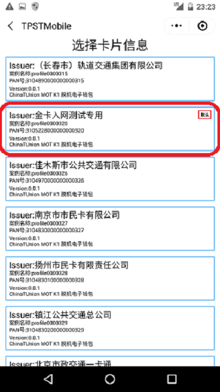

===========================
微信小程序（NFC）兼容性测试
===========================

文档编号：ZJJK-3000-14

实验室TPST(Mobile)账号注册
---------------------------------

.. toctree::
   :maxdepth: 1
   
   ../IOT/Register

手机NFC设置说明
---------------------------------

.. toctree::
   :maxdepth: 1
   
   ../IOT/HCE

微信小程序（NFC）兼容性测试
---------------------------------

.. Note :: 选择要测试的NFC手机，扫描微信小程序码进入小程序

.. image:: ../_images/wechat-app-screenshot.png
    :width: 800px
    :height: 500px

    

.. Note :: 进入微信小程序,按提示设置NFC.

.. image:: ../_images/wechat_UI_NFC0.jpg
    :width: 324px
    :height: 576px

.. Note :: 在android手机中设置默认NFC支付方式为微信.

.. image:: ../_images/wechat_UI_NFC.jpg
    :width: 324px
    :height: 576px
	

.. Note :: 在微信中选择TPSTMobile小程序.

.. image:: ../_images/wechat_UI_0.png
    :width: 324px
    :height: 576px
	
	

.. Note :: 进入第1个界面，介绍和简单使用说明，勾选下面表示同意将相关测试数据上传给金卡公司检测实验室用于数据分析.

.. image:: ../_images/wechat_UI_1.png
    :width: 324px
    :height: 576px
	

.. Note :: 进入第2个界面，在对话框中输入要使用的TPST(Mobile)账号、密码和验证码（不区分大小写）.

.. image:: ../_images/wechat_UI_2.png
    :width: 324px
    :height: 576px
	

.. Note :: TPSTMobile账号校验失败，将以普通游客方式登录，仍可（默认加载卡片profile0000320）使用部分测试功能.

.. image:: ../_images/wechat_UI_3.png
    :width: 324px
    :height: 576px
	

.. Note :: TPSTMobile账号校验成功，进入第三个界面，输入被测终端TPUT相关信息.

.. image:: ../_images/wechat_UI_4.png
    :width: 324px
    :height: 576px
	

.. Note :: 在第三个界面选择测试卡片，选择测试卡片profile0000320数据.

	

	

.. Note :: 被测终端（TPUT）需连接至【测试平台】并加载卡片业务白名单(按照2020年5月15日通知公布的机构信)，文件格式参考下图：（其中机构代码：09981001/31052280 为互联互通Kx入网kernel测试专用）.

.. image:: ../_images/card_app_white_list.png
    :width: 617px
    :height: 467px	
	

.. Note :: 选择上面成员机构的测试卡片，且输入被测终端PUT相关信息后，进入最后一个界面，对PUT进行刷卡兼容性测试，profile0000320应执行交易成功，测试完成后小程序自动上传相关数据及测试结果给金卡检测实验室.

.. image:: ../_images/wechat_UI_6.png
    :width: 324px
    :height: 576px

