====================
微信小程序白名单测试
====================

文档编号：ZJJK-3000-11

.. Note :: 扫描微信小程序码进入小程序

.. Note :: 进入微信小程序,按提示设置NFC.

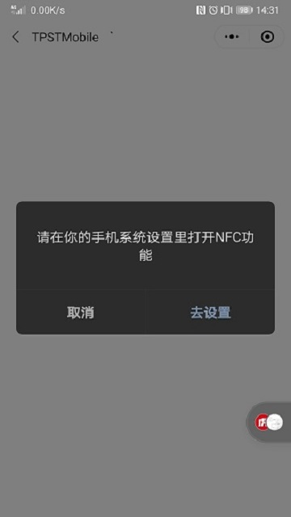

.. Note :: 在android手机中设置默认NFC支付方式为微信.

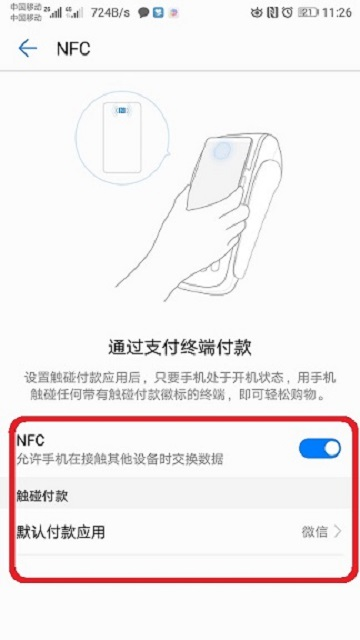
	

.. Note :: 在微信中选择TPSTMobile小程序.

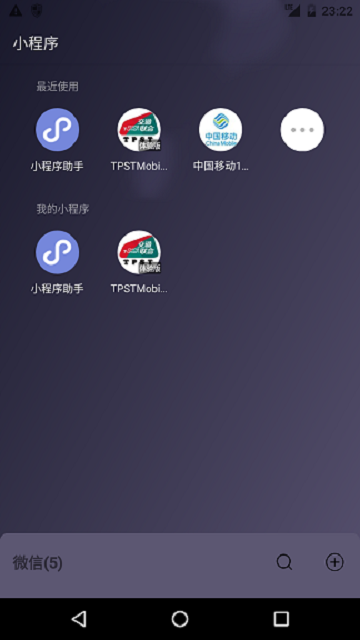
	
	

.. Note :: 进入第1个界面，介绍和简单使用说明，勾选下面表示同意将相关测试数据上传给金卡公司检测实验室用于数据分析.

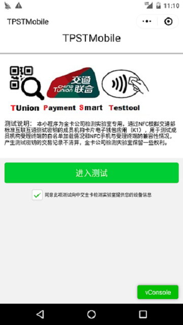
	

.. Note :: 进入第2个界面，在对话框中输入要使用的TPST(Mobile)账号、密码和验证码（不区分大小写）.

.. warning:: TPST(Mobile)账号注册链接：https://tpstmobile.t-union.com/ZjjkManagerService/register

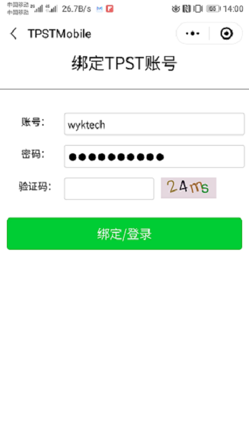
	

.. Note :: TPSTMobile账号校验失败，将以普通游客方式登录，仍可（默认加载卡片profile0000320）使用部分测试功能.

.. warning:: TPST(Mobile)密码重置链接：https://tpstmobile.t-union.com/ZjjkManagerService/lostPwd

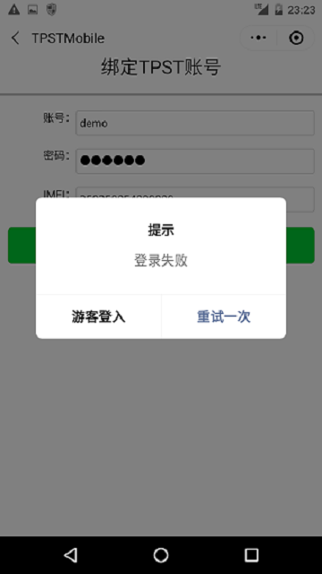
	

.. Note :: TPSTMobile账号校验成功，进入第三个界面，输入被测终端TPUT相关信息.

.. warning:: 请务必填写 终端编号（TPUT12345678）、所在城市和交通方式（公交/地铁）

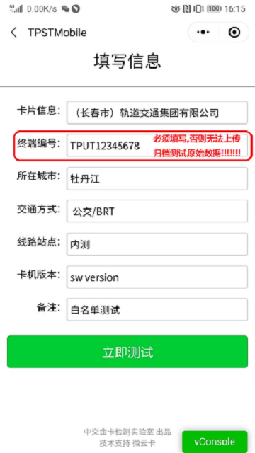
	

.. Note :: 在第三个界面选择测试卡片，进入测试卡片profile数据(按照2020年5月15日通知公布的机构信息,以卡片profile编号排序) . 选择界面.

.. warning:: 请选择列表中的第二个：金卡入网测试专用

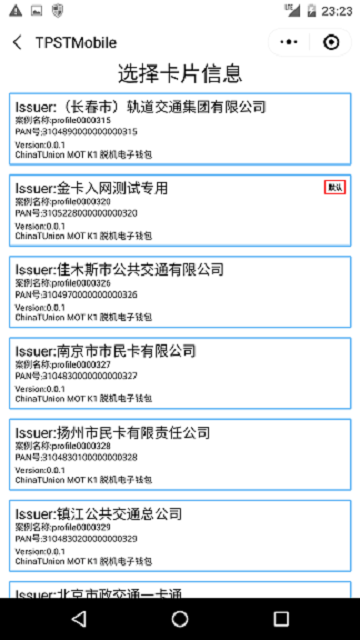
	

	

.. Note :: 被测终端（TPUT）需连接至【测试平台】并加载卡片业务白名单  文件格式参考下图：（其中机构代码：09981001/31052280 为互联互通Kx入网kernel测试专用）.

白名单文件sample下载: https://gitlab.t-union.com/tpstmobile/release/-/blob/master/卡片业务白名单sample

.. image:: ../_images/card_app_white_list.png
    :width: 617px
    :height: 467px	
	

.. Note :: 选择上面成员机构的测试卡片，且输入被测终端PUT相关信息后，进入最后一个界面，对PUT进行刷卡白名单测试，白名单内案例终端应执行至debit指令失败，测试完成后小程序自动上传相关数据及测试结果给金卡检测实验室.

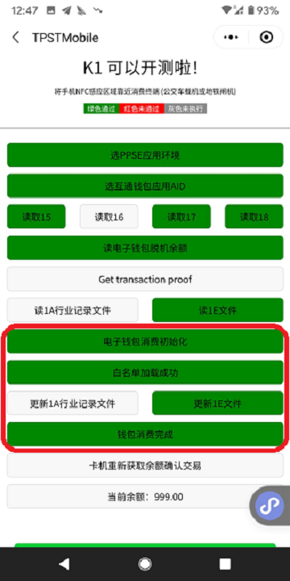
	

.. Note :: 选择上面成员机构的测试卡片，且输入被测终端PUT相关信息后，进入最后一个界面，对PUT进行刷卡白名单测试，白名单外的案例终端应拒绝交易(报出错码2449/或5469)，测试完成后小程序自动上传相关数据及测试结果给金卡检测实验室.

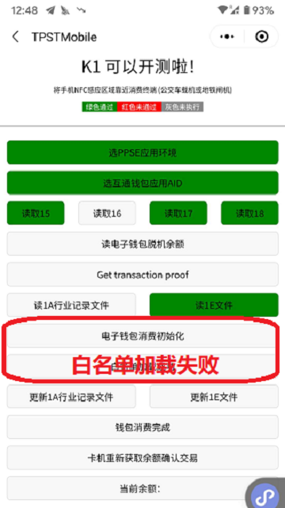
	
	

.. Note :: 测试完成后小程序自动上传相关数据及测试结果给金卡检测实验室，并弹出如下对话框，用户选择【下一张卡】，小程序加载当前卡片特征数据相邻的下一张卡片特征数据再进行刷卡白名单测试；.

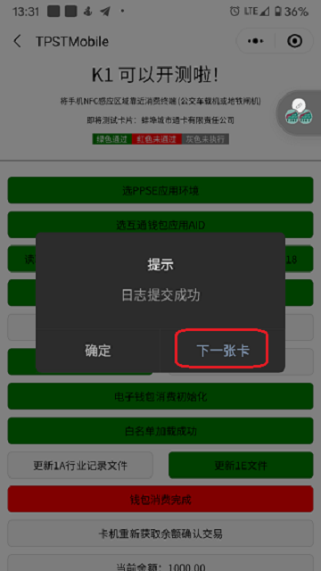
	

